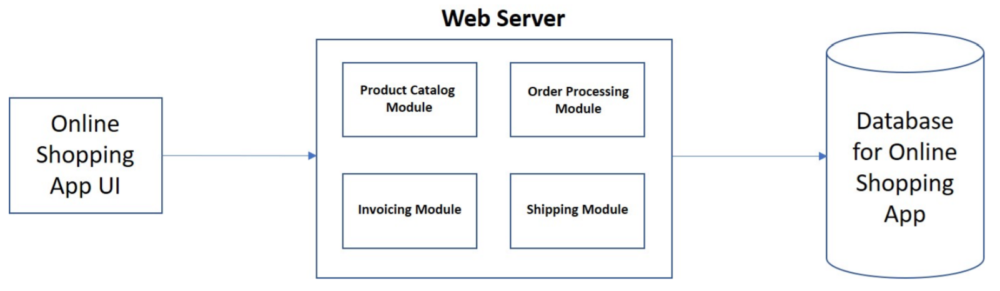
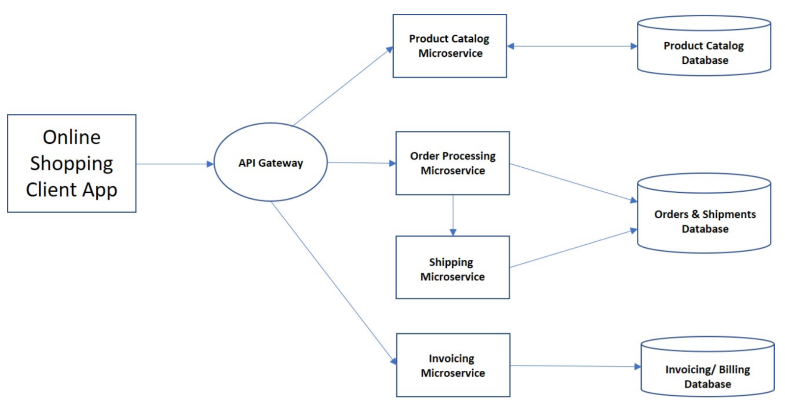

# NIST Special Publication 800-204

マイクロサービスを用いたアプリケーションシステムのセキュリティ戦略 
Ramaswamy Chandramouli 

This publication is available free of charge from: https://doi.org/10.6028/NIST.SP.800-204 

## Authority

このドキュメントは、2014年の連邦情報セキュリティ近代化法(FISMA)、44 U.S.C. §3551以降、Public Law(P.L.)113-283に基づく法定責任に従ってNISTによって作成されました。NISTは、連邦政府の情報システムの最小要件を含む情報セキュリティの標準とガイドラインを策定する責任がありますが、そのような標準とガイドラインは、そのようなシステムに対する政策権限を行使する適切な連邦政府職員の明示的な承認がない限り、国家のセキュリティシステムには適用されません。このガイドラインは、Office of Management and Budget(OMB)Circular A-130の要件と一致しています。
このドキュメントのいかなる内容も、法定の権限の下で商務長官によって連邦機関に義務的かつ拘束力を与えられた基準とガイドラインに矛盾するものではありません。また、これらのガイドラインは、商務長官、OMBのディレクター、またはその他の連邦政府当局者の既存の当局を変更または置き換えるものと解釈されるべきではありません。このドキュメントは、非政府組織が自発的に使用する場合があり、米国では著作権の対象ではありません。ただし、帰属する場合はNISTに評価されます。

検証手順または概念を適切に説明するために、このドキュメントでは特定の営利団体、機器、または材料を特定する場合があります。このような識別は、NISTによる推奨または承認を意味するものではなく、エンティティ、素材、または機器が必ずしもその目的に最適であることを意味するものでもありません。
このドキュメントには、割り当てられた法的責任に従って、NISTが現在作成中の他のドキュメントへの参照が含まれている場合があります。概念および方法論を含むこのドキュメントの情報は、そのような関連ドキュメントが完成する前であっても、連邦政府機関によって使用される場合があります。したがって、各ドキュメントが完了するまで、現在の要件、ガイドライン、および手順(存在する場合)は有効です。計画および移行の目的で、連邦政府機関は、NISTによるこれらの新しいドキュメントの開発を厳密に追跡することを望んでいる場合があります。パブリックコメント期間中にすべてのドラフト版をレビューし、NISTにフィードバックを提供することが推奨されます。上記以外の多くのNISTサイバーセキュリティドキュメントは、https://csrc.nist.gov/publications で入手できます。 

## Reports on Computer Systems Technology

米国国立標準技術研究所(NIST)の情報技術研究所(ITL)は、米国の測定および標準インフラストラクチャの技術的なリーダーシップをとり、米国経済と公共の福祉を促進しています。ITLは、情報技術の開発と生産的な利用を促進するために、テスト、テスト方法、参照データ、概念実証の実装、および技術分析を開発します。ITLの責任には、連邦情報システム内の国家安全保障関連情報以外の費用対効果の高い安全性とプライバシーに関する管理、管理、技術、物理の基準とガイドラインの開発が含まれます。Special Publication 800シリーズでは、ITLの研究、ガイドライン、情報システムセキュリティに関するアウトリーチの取り組み、および業界、政府、学術機関との共同活動について報告しています。 

## Abstract

マイクロサービスアーキテクチャは、より小さなコードベースにより、マイクロサービスの種類に基づいたプラットフォームの最適化、独立した開発チームのサポート、および各コンポーネントのスケーリング機能が独立して促進されるため、アプリケーション開発にますます利用されるようになっています。通常、マイクロサービスはApplication Programming Interfaces(API)を使用して相互に通信します。APIには、多数のコンポーネント間の複雑な相互作用をサポートするためのいくつかのコア機能が必要です。これらのコア機能には、認証とアクセス管理、サービス検出、安全な通信プロトコル、セキュリティ監視、可用性/復元力向上技術(サーキットブレーカーなど)、負荷分散と調整、新しいサービスの導入時の整合性保証技術、セッション永続性の処理が含まれます。さらに、APIゲートウェイやサービスメッシュなどのアーキテクチャフレームワークにコア機能をバンドルまたはパッケージ化できます。このドキュメントの目的は、アーキテクチャフレームワークの個々のコア機能と構成オプションで利用可能な複数の実装オプションを分析し、マイクロサービス固有の脅威に対抗するセキュリティ戦略を開発し、マイクロサービスベースのアプリケーションの全体的なセキュリティプロファイルを強化することです。

## Keywords

マイクロサービス;ロードバランシング; サーキットブレーカー; Application Programming Interface (API); API ゲートウェイ; サービスメッシュ; プロキシ

## Acknowledgements

著者Ramaswamy Chandramouliは、SynopsysのDavid Bohannon、Travis Biehn、John Tapp、Jamie Boote、およびForgerockのSimon Moffattに対して、様々なトピックについての詳細なコメントの提供に深謝します。彼は、Wangoh Dynamics TechnologiesのSaa Edward Fillie、DSD LaboratoriesのCarlo de Guzman、およびStackRoxのWei Lien Dangにも感謝の意を表します。貴重なインラインコメントと参考文献への追加を提供してくれたT-MobileのDoug McDormanに感謝します。最後になりましたが、彼はG2-IncのIsabel Van Wykによる詳細な編集レビューに感謝します。

## Patent Disclosure Notice

Notice:NISTの情報技術研究所(ITL)は、この出版物のガイダンスまたは要件を順守するために使用が必要となる可能性のある特許クレームの所有者に、そのような特許クレームをITLに開示するよう要求しました。ただし、特許の所有者は、ITLが特許を要求することに対応する義務を負わず、ITLは、この出版物に適用される可能性のある特許を特定するための特許調査を行っていません。
本書のガイダンスおよび要件を遵守するために使用が必要となる可能性のある特許クレームの特定を求めるための発行日およびその後の呼び出しの時点で、そのような特許クレームはITLに対して特定されていません。
ITLは、この出版物の使用における特許侵害を回避するためにライセンスが必要ないことを表明または暗示しません。 

## Executive Summary

マイクロサービスパラダイムは、クラウドベースのインフラストラクチャとエンタープライズインフラストラクチャの両方で大規模なアプリケーションシステムを設計および展開するためにますます利用されています。結果として得られるアプリケーションシステムは、軽量の通信プロトコルを使用して相互に通信するマイクロサービスと呼ばれる、比較的小さく疎結合のエンティティまたはコンポーネントで構成されます。
マイクロサービスベースのアプリケーションシステムを設計および展開するインセンティブには、次のものがあります。(a)通常、各コードベースは単一のビジネス機能を実装しているため、コードベースは比較的小さく複雑ではないため、開発の俊敏性が向上します。(b)マイクロサービスの疎結合性のため、開発プロセスにおけるチーム間の独立性が向上します。(c)認証、アクセス制御、サービスの検出と通信、負荷分散などのインフラストラクチャサービスを提供する展開ツールの可用性が向上します。
いくつかの促進技術(オーケストレーションなど)にも係わらず、マイクロサービスベースのアプリケーションの開発と展開には多くの課題に対処する必要があります。このタイプのシステムを使用して実装されるすべてのトランザクションには、ネットワークを介したメッセージの送信が含まれるため、ネットワークのセキュリティ、信頼性、および待ち時間は重要な要素です。さらに、複数のマイクロサービスの存在により、大きな攻撃対象領域が明らかになります。
このドキュメントの目的は、コア機能の実装オプション、アーキテクチャフレームワークの構成オプション、マイクロサービス固有の脅威への対策の分析を行い、セキュリティ戦略を概説することです。

## 1 Introduction

基になるプロセスを自動化するためのツールの俊敏性、柔軟性、拡張性、可用性などの利点により、マイクロサービスを用いたアプリケーションシステムの開発と展開が増えています。ただし、コンポーネント間のさまざまな相互作用スタイルで構成される複雑なネットワーク環境と組み合わされたマイクロサービスベースのアプリケーションシステムのコンポーネント数の大幅な増加により、APIゲートウェイおよびサービスメッシュなどのように、いくつかのコアインフラストラクチャ機能を単独で、またはアーキテクチャフレームワークにバンドル/パッケージ化して実装する必要があります。このドキュメントの目的は、コア機能の実装オプション、アーキテクチャフレームワークの構成オプション、マイクロサービス固有の脅威への対策の分析を行い、セキュリティ戦略を概説することです。

### 1.1 Scope 

このドキュメントでは、マイクロサービスベースのアプリケーションシステムの展開で使用されるさまざまなツールについては解説しません。コア機能とアーキテクチャフレームワークの説明は、安全な実装に関連する問題の強調に限定されます。中核となる焦点は、次の3つの基本的な手順を通じて、マイクロサービスベースのアプリケーションのセキュリティ戦略を開発する方法論です。

* 設計原則、基本的な構成要素、および関連するインフラストラクチャに焦点を合わせた、マイクロサービスベースのアプリケーションシステムの背後にある技術の学習。
* マイクロサービスの動作環境に固有な脅威に関する背景への集中的なレビュー。
* コア機能の実装オプション、APIゲートウェイやサービスメッシュなどのアーキテクチャフレームワークに関連する構成オプション、およびセキュリティ戦略を開発するためのマイクロサービス固有の脅威への対策の分析。

### 1.2 Audience 

このドキュメントで説明するセキュリティ戦略の対象読者は次のとおりです。 

* 以下に属するIT部門の最高セキュリティ責任者(CSO)または最高技術責任者(CTO)

  マイクロサービスアーキテクチャに基づく分散システムをホストするエンタープライズインフラストラクチャの開発を希望する民間企業または政府機関。 

*  マイクロサービスベースのアプリケーションシステムを設計したいアプリケーション設計者。

### 1.3 Relationship to other NIST Guidance Documents

このガイダンスドキュメントは、特定のアーキテクチャに基づくアプリケーションのクラスに焦点を当てています。ただし、重要なアーキテクチャコンポーネント(マイクロサービス)はコンテナ内に実装できるため、アプリケーションコンテナテクノロジに関連するセキュリティガイダンスと推奨事項は、このドキュメントで説明するアプリケーションアーキテクチャに関連するセキュリティ戦略としても機能します。そのようなガイダンスには以下が含まれます。 

* NIST Special Publication (SP) 800-190, アプリケーションコンテナセキュリティガイド 
* NIST Interagency or Internal Report (NISTIR) 8176, Linuxアプリケーションコンテナー展開のセキュリティ保証要件

### 1.4 Methodology and Organization 

マイクロサービスベースのアプリケーションシステムにはさまざまなテクノロジー(サーバー仮想化、コンテナ、クラウドミドルウェアなど)が含まれるため、ここでは、このアプリケーションクラスのコア機能とそれらをバンドルまたはパッケージ化するアーキテクチャフレームワークに焦点を当てます。 脅威分析アプローチでは、マイクロサービスベースのアプリケーションシステムの展開スタック全体と、これらのコア機能が配置されているレイヤーのマクロビューを取得します。これらの機能に固有の脅威が特定され、セキュリティ戦略を開発するための全体的なアプローチは、コア機能とアーキテクチャフレームワークの複数の実装を分析し、それらの実装オプションがマイクロサービス固有の脅威に対抗することを確認することです。この方法で使用される資料のロードマップは次のとおりです。 

* マイクロサービスのインフラストラクチャを形成する実践的なコア機能のすべてのレビュー。(セクション2.6)
* 展開スタック内のレイヤーのレビュー、それらのレイヤーのコア機能の場所、およびマイクロサービス固有の脅威の特定。(セクション3)
* これらのコア機能のすべての異なる実装オプションの分析と、コア機能のこれらの実装オプションに基づくセキュリティ戦略の概要。(セクション4)
* いくつかのコア機能を単一の製品としてバンドルするすべてのアーキテクチャフレームワークのレビュー、およびそれらのフレームワークの構成オプションに基づいたセキュリティ戦略の概要を説明します。(セクション5)

このドキュメントのさまざまなセクションの内容のもう少し詳細な要約は次のとおりです。

* セクション2では、マイクロサービスベースのアプリケーションシステムの概要を説明します。概念図から始まり、設計原則、ビジネスドライバー、ビルディングブロック、コンポーネントの相互作用スタイル、プラクティスのコア機能、およびアーキテクチャフレームワークが続きます。
* セクション3は、脅威の背景とマイクロサービス環境に固有のいくつかの脅威のスタックレベルのビューを提供します。
* セクション4には、マイクロサービスベースのアプリケーションをサポートするための実践的なコア機能のさまざまな状態に関する分析情報が含まれ、実装オプションの分析に基づいてコア機能を実装するためのセキュリティ戦略の概要を示します。
* セクション5には、マイクロサービスベースのアプリケーションのインフラストラクチャに必要なコア機能をバンドルするアーキテクチャフレームワークに関する分析情報が含まれ、アーキテクチャフレームワークを構成するためのセキュリティ戦略の概要が示されています。

## 2 Microservices-based Application Systems: Technology Background

このセクションでは、ビルディングブロックを構成するアーティファクトや、さまざまな展開オプションを生成するためにビルディングブロックを構成するさまざまな方法といった、マイクロサービスベースのアプリケーションシステムの開発と展開の背後にあるテクノロジーについて、基礎となる設計ドライバーまたは原則を用いて説明します。これは、技術の包括的な説明を意図したものではありませんが、セキュリティの脅威の識別とマイクロサービスベースのアプリケーションシステムの安全な実装戦略の開発を促進するためのコンポーネントと概念に関する十分な情報を提供します。

### 2.1 Microservices: A Conceptual View 

マイクロサービスベースのアプリケーションシステムは、同期リモートプロシージャコールまたは非同期メッセージングシステムを介して互いに通信する複数のコンポーネント(マイクロサービス)で構成されます。通常、各マイクロサービスは、1つ(まれに)異なるビジネスプロセスまたは機能(たとえば、顧客の詳細の保存、製品カタログの保存と表示、顧客の注文処理など)を実装します。各マイクロサービスは、データベースアクセスやメッセージングなどの機能を実行するための独自のビジネスロジックとさまざまなアダプターを備えたミニアプリケーションです。一部のマイクロサービスは、他のマイクロサービスまたはアプリケーションのクライアントによって消費されるRepresentational State Transfer(REST)ful API [1]を公開します[2]。他のマイクロサービスは、Webユーザーインターフェイス(UI)を実装する場合があります。実行時に、マイクロサービスインスタンスは、アプリケーションサーバー、仮想マシン(VM)、またはコンテナのプロセスとして実行するように構成できます。
マイクロサービス ベースのアプリケーションは、クラウド サービスとしてではなく、純粋にエンタープライズ アプリケーションとして実装できますが、多くの場合、サービスベースのアーキテクチャ、API駆動の通信、コンテナベースのインフラストラクチャや継続的改善、アジャイル開発、 継続的デリバリー、開発者や品質保証チーム、セキュリティ専門家、IT運用、および基幹業務の利害関係者[3]間の共同開発といったDevOps(開発と運用の組み合わせ)プロセスのバイアスを備えたクラウド ネイティブ アプリケーションとして識別されます。この観点の理由の一部は、オンプレミスのソフトウェア開発と展開が、APIベースの通信を備えた疎結合のサービスベースアーキテクチャではなく、緊密に統合されたアプリケーションモジュールを備えたサーバー中心のインフラストラクチャに依存しているという事実によるものです。 

### 2.2 Microservices: Design Principles 

マイクロサービスの設計は、次のドライバーに基づいています[4]: 

* 各マイクロサービスは、他のマイクロサービスとは独立して管理、複製、スケーリング、アップグレード、および展開する必要があります。
* 各マイクロサービスは単一の機能を持ち、制限されたコンテキストで動作する必要があります(つまり、責任が制限され、他のサービスに依存します)。
* すべてのマイクロサービスは、継続的な障害と回復のために設計される必要があるため、可能な限りステートレスでなければなりません。
* 既存の信頼できるサービス(データベース、キャッシュ、ディレクトリなど)を状態管理に再利用する必要があります。

これらのドライバーは、マイクロサービスの次の設計原則をもたらします。  

* 自律性
* 疎結合性
* 再利用性
* コンポーザビリティ
* フォールトトレランス
* 発見可能性
* ビジネスプロセスとのAPIの整合性

### 2.3 Business Drivers 

マイクロサービスベースのアプリケーションシステムの展開のビジネスドライバーは、このドキュメントのテーマにわずかに関連しているだけですが、ユーザーと組織の行動の観点から関連するものを特定し、述べることは有用です[5]。 

* ユビキタスアクセス:ユーザーは、複数のクライアントデバイス(ブラウザー、モバイルデバイスなど)からアプリケーションにアクセスできることを望んでいます。
* スケーラビリティ:ユーザー数の増加や既存のユーザーベースからの使用率の増加に直面して可用性を維持するには、アプリケーションのスケーラビリティを高める必要があります。
* アジャイル開発:組織は、組織(プロセスおよび構造)の変更および市場の要求に迅速に対応するために、頻繁な更新を必要としています。

### 2.4 Building Blocks 

マイクロサービスベースのアプリケーション(たとえば、分散エンタープライズまたはWebアプリケーション[1])は、特定の技術に制限されず、軽量なメカニズムを用いて相互に通信する小さな独立したエンティティ(エンドポイント)で構成されるアーキテクチャスタイルまたはデザインパターンを使用して構築されます。これらのエンドポイントは、明確に定義されたAPIを使用して実装されます。APIエンドポイントには、シンプルオブジェクトアクセスプロトコル(SOAP)やREST(ハイパーテキスト転送プロトコル(HTTP)プロトコル)など、いくつかのタイプがあります。 小規模の独立した各エンティティは、「サービス」と呼ばれる独自のビジネス機能を提供し、独自のデータストアまたはリポジトリを持つことができます。 これらのサービスへのアクセスは、「クライアント」と呼ばれるコンポーネントを使用して、Webブラウザやモバイルデバイスなどのさまざまなプラットフォームまたはクライアントタイプによって提供されます。コンポーネントサービスとクライアントは、完全なマイクロサービスベースのアプリケーションシステムを形成します。 このようなシステムのサービスは、次のように分類できます。 

* アプリケーション機能サービス。
* スタンドアロン機能として実装されるか、アーキテクチャフレームワーク(APIゲートウェイ、サービスメッシュなど)にバンドルされるインフラストラクチャサービス(このドキュメントでは「コア機能」と呼ばれます)。 これには、認証と承認、サービスの登録と検出、セキュリティ監視が含まれますが、これらに限定されません。

マイクロサービスベースのアプリケーションシステムでは、複数のコラボレーションサービスのそれぞれを、異なるテクノロジーを使用して構築できます。これにより、技術的な異質性の概念が促進されます。つまり、マイクロサービスベースのアプリケーションシステムの各サービスは、異なるプログラミング言語、開発プラットフォーム、または異なるデータストレージテクノロジーを使用して記述できます。この概念により、開発者はサービスのタイプに応じて適切なツールまたは言語を選択できます。したがって、単一のマイクロサービスベースのアプリケーションシステムでは、構成するサービスは異なる言語(Ruby、Golang、Javaなど)を使用して構築したり、異なるストア(ドキュメントデータストア、グラフィカルデータベース(DB)、またはマルチメディアDB )をホストしたりできます。各コンポーネントサービスはチーム(マイクロサービスまたはDevOpsチーム)によって開発され、サービスの機能またはサービス契約が合意されている限り、そのサービスのすべての開発および運用要件に開発および展開技術に関する高度な自律性を提供します[6]。
マイクロサービスのサービスは、異なるノードに個別に展開されます。それらの間の通信は、ローカル関数呼び出しからリモート呼び出しに変換されます。これは、ネットワーク通信に固有の待ち時間があるため、システムのパフォーマンスに影響を与える可能性があります。したがって、軽量の通信インフラストラクチャが必要です。
スケーリングは、中央処理装置(CPU)またはメモリリソースが不十分であるためにパフォーマンスのボトルネックがあるサービスに選択的に適用できますが、他のサービスはより小さく、安価なハードウェアを使用して実行を継続できます。そのようなサービスに関連付けられた機能は、さまざまな目的でさまざまな方法で消費される可能性があり、それによって再利用性と構成可能性が促進されます。1つの例には、顧客データベースサービスが含まれます。その内容は、船荷証券を作成するための出荷部門と、売掛金勘定または請求書を送信する請求部門の両方で使用されます。

### 2.5 Microservices: Interaction Styles 

モノリシックアプリケーションでは、各コンポーネント(プロシージャまたは関数)は、メソッドや関数などの言語レベルの呼び出しを使用して別のコンポーネントを呼び出します。 マイクロサービスベースのアプリケーションでは、各サービスは通常、プロセス間通信メカニズム(IPC)[7]を介して他のサービスと通信する独自のネットワークノードで実行されるプロセスです。 さらに、サービスはインターフェイス定義言語(IDL)(Swagger / OpenAPIなど)を使用して定義されるため、アプリケーションプログラミングインターフェイス(API)と呼ばれる成果物が生成されます。 サービス開発の最初のステップでは、インターフェイス定義を作成します。これは、クライアント開発者がレビューし、サービスの実装が開始される前に何度も繰り返されます。 したがって、APIはクライアントとサービスの間のコントラクトとして機能します。
IPCメカニズムの選択により、APIの性質が決まります[7]。 表1は、各IPCメカニズムのAPI定義の性質を示しています。 

Table 1: IPC Mechanisms and API Types
|IPCメカニズム|API定義の性質|
|:---|:---|
|非同期、メッセージベース(例:Advanced Message Queuingプロトコル(AMQP)またはシンプル(またはストリーミング)テキスト指向のメッセージングプロトコル。(STOMP))|メッセージチャネルとメッセージタイプで構成|
|同期リクエスト/レスポンス(例:HTTPベースのRESTまたはThrift)|Uniform Resource Locator(URL)とリクエストとレスポンスのフォーマット|

IPC通信で使用されるメッセージ形式にはさまざまな種類があります。JavaScriptObject Notation(JSON)やExtensible Markup Language(XML)などのテキストベースで人間が読み取れる形式、またはApacheなどの純粋に機械で読み取り可能なバイナリ形式Avroまたはプロトコルバッファなど。
前述の自律の原則では、各マイクロサービスが、アプリケーションスタックのすべての機能を提供する自己完結型エンティティであることが必要になる場合があります。ただし、複数のビジネスプロセス機能を提供するマイクロサービスベースのアプリケーション(注文、配送、請求などのビジネスプロセスを提供するオンラインショッピングアプリケーションなど)の場合、コンポーネントマイクロサービスは常に何らかの形で別のマイクロサービスに依存しています(例:データ)。この例のコンテキストでは、出荷マイクロサービスは注文マイクロサービスの「未履行注文」データに依存して、出荷または船荷証券レコードを生成する機能を実行します。したがって、自律性を維持しながらマイクロサービスを結合する必要が常にあります。多くの場合、ビジネスプロセスとITインフラストラクチャのニーズによって決まるカップリングを作成するためのさまざまなアプローチには、相互作用パターン、メッセージングパターン、および消費モードが含まれます。このドキュメントでは、「相互作用パターン」という用語を使用します。主要な相互作用パターンは次のとおりです。

`要求-応答`:2つの異なるタイプの要求には、情報を取得するためのクエリと、状態が変化するビジネス機能のコマンドが含まれます[2]。 最初のタイプでは、マイクロサービスは特定の情報要求またはアクションを実行し、機能的に応答を待ちます。 情報のリクエストの目的は、プレゼンテーション目的での取得です。 2番目のタイプでは、あるマイクロサービスが別のマイクロサービスに、状態が変化するビジネス機能(たとえば、顧客が自分の個人プロファイルを変更したり、注文を送信したり)を伴うアクションを実行するように要求します。 要求/応答パターンでは、関係する2つのマイクロサービス間に強力なランタイム依存関係があり、次の2つの方法で現れます。 

* 1つのマイクロサービスが機能を実行できるのは、他のマイクロサービスが利用可能な場合のみです。
* 要求を行うマイクロサービスは、要求がターゲットマイクロサービスに正常に配信されたことを確認する必要があります。

要求/応答プロトコルでの通信の性質のため、HTTPなどの同期通信プロトコルが使用されます。 マイクロサービスがREST APIで実装されている場合、マイクロサービス間のメッセージはHTTP REST API呼び出しになります。 REST APIは、多くの場合、マイクロサービスインターフェイスの定義と公開のために開発されたRAML(RESTful API Modeling Language)などの標準化された言語を使用して定義されます。 HTTPは、要求を開始したクライアントが応答を受信した場合にのみタスクを続行できるブロックタイプの通信です。 
パブリッシュ/サブスクライブ:このパターンは、複雑なビジネスプロセスまたはトランザクションの実現のためにマイクロサービスが連携する必要がある場合に使用されます。これは、ビジネスドメインイベント駆動型アプローチまたはドメインイベントサブスクリプションアプローチとも呼ばれます。このパターンでは、マイクロサービスはそれ自体を登録するか、ビジネスバスイベント(たとえば、特定の情報に関心がある、または特定の要求を処理できる)にサブスクライブします。これらのマイクロサービスは、イベント駆動型APIを使用して構築され、メッセージキューテレメトリトランスポート(MQTT)、アドバンストメッセージキュープロトコル(AMQP)、Kafkaメッセージングなどの非同期メッセージングプロトコルを使用して、通知とサブスクリプションのサポートを有効にします。非同期プロトコルでは、メッセージ送信者は通常、応答を待つのではなく、メッセージをメッセージエージェント(RabbitMQキューなど)に送信するだけです。このアプローチのユースケースの1つは、特定のイベントに基づいた複数のマイクロサービスへのデータ更新の伝播です[8]。 

### 2.6 Microservices: State of the Practice Core Features 

マイクロサービスベースのアプリケーション環境における通信インフラストラクチャの重要性は、多くの展開でコア機能として提供されるいくつかの高度な機能を必要とします。 既に述べたように、これらの機能の多くは、スタンドアロンで実装することも、APIゲートウェイやサービスメッシュなどのアーキテクチャフレームワークにバンドルして実装することもできます。 APIゲートウェイ内でも、これらの機能は、サービス構成またはコードベース内での直接実装を通じて実装できます。 これらの機能には、認証、アクセス制御、サービス検出、負荷分散、応答キャッシュ、アプリケーション対応のヘルスチェック、監視が含まれますが、これらに限定されません[2]。 これらの機能の簡単な説明[5]には以下が含まれます。 

* 認証とアクセス制御:認証とアクセスポリシーは、マイクロサービスによって公開されるAPIの種類によって異なる場合があります。一部はパブリックAPIである場合があります。 一部はプライベートAPIかもしれません。 一部はパートナーAPIであり、ビジネスパートナーのみが利用できます。
* サービスの検出:レガシー分散システムでは、指定された場所(IPアドレスとポート番号)で動作するように構成された複数のサービスがあります。 マイクロサービスベースのアプリケーションには、次のシナリオが存在し、堅牢なサービス検出メカニズムが必要です。

  a)かなりの数のサービスと、動的に変化する場所を持つ各サービスに関連付けられた多くのインスタンスがあります。  
  b)各マイクロサービスは、VM内またはコンテナとして実装できます。特に、サービスとしてのインフラストラクチャ(IAAS)またはサービスとしてのソフトウェア(SAAS)クラウドサービスでホストされている場合は、動的IPアドレスが割り当てられます。  
  c)サービスに関連付けられたインスタンスの数は、自動スケーリングなどの機能を使用して、負荷の変動に基づいて変化する可能性があります。  
 
* セキュリティの監視と分析 - 攻撃を検出し、サービスの低下要因(可用性に影響する可能性がある)を特定するには、定期的なログ機能に加えて分析機能を使用して、マイクロサービスのネットワークトラフィックを監視する必要があります。

APIゲートウェイまたはマイクロゲートウェイは、通常、次のコア機能を実装するために使用されます。 

* 最適化されたエンドポイント:これにはいくつかの機能が含まれます。

  a)要求と応答の崩壊:ほとんどのビジネストランザクションには、多くの場合、事前に決められた順序での複数のマイクロサービスへの呼び出しが含まれます。 APIゲートウェイは、必要な複数の要求(呼び出し)をすべて自動的に行い、単一の集約された応答をクライアントに返すエンドポイントを公開することにより、クライアントの状況を簡素化できます。
  b)API変換:APIゲートウェイは、クライアントにパブリックインターフェイスを提供できます。

これは、特定のリクエストに応えるために呼び出す必要のある個々のAPIとは異なります。この機能はAPI変換と呼ばれ、以下を可能にします。

    i)個々のマイクロサービスの実装とAPIインターフェイスの変更  
    ii)モノリシックアプリケーションを徐々に分割し、バックグラウンドでマイクロサービスAPIを作成し、それに応じてAPI変換構成を変更しながら、APIゲートウェイを介してクライアントに継続的にアクセスできるようにすることにより、初期のモノリシックアプリケーションからマイクロサービスベースのアプリケーションに移行します。  
  c)プロトコル変換:クライアントからマイクロサービスエントリポイントへの呼び出しは、ハイパーテキスト転送プロトコルセキュア(HTTPS)などのWebプロトコルで行われますが、マイクロサービスは、リモートプロシージャコール(RPC)/スリフトまたは非同期などの同期プロトコルを使用して相互に通信しますAMQPなどのプロトコル。クライアント要求で必要なプロトコル変換は通常、APIゲートウェイによって実行されます。  

* サーキットブレーカー:これは、マイクロサービスのインスタンスに対する失敗した応答のしきい値を設定し、障害がしきい値を超えたときにそのインスタンスへのプロキシ要求を遮断する機能です。これにより、カスケード障害の可能性が回避され、ログの分析、必要な修正の実装、および障害が発生したインスタンスの更新のプッシュが可能になります。
* 負荷分散:同じサービスの複数のインスタンスを用意する必要があり、これらのインスタンスの負荷を均等に分散して、過負荷による応答の遅延やサービスクラッシュを回避する必要があります。
* レート制限(スロットル):すべてのクライアントのサービスの継続的な可用性を確保するために、マイクロサービスに着信するリクエストのレートを制限する必要があります。
* ブルー/グリーン展開:マイクロサービスの新しいバージョンが展開されると、APIゲートウェイは両方のバージョンの場所を認識するようにプログラムできるため、古いバージョンを使用している顧客からの要求を新しいバージョンにリダイレクトできます。
* カナリアリリース:すべての動作シナリオでの応答またはパフォーマンスメトリックの正確性が完全にわかっていないため、限られた量のトラフィックのみがマイクロサービスの新しいバージョンに最初に送信されます。動作特性に関する十分なデータが収集されると、すべてのリクエストを新しいバージョンのマイクロサービスにプロキシできます。 

### 2.7 Microservices: Architectural Frameworks 

マイクロサービスベースのアプリケーションで主に信頼性、復元力、および安全な通信を保証するコア機能をバンドルまたはパッケージ化するための2つの主要なアーキテクチャフレームワークは次のとおりです。 

* マイクロゲートウェイの有無にかかわらず強化されたAPIゲートウェイ。
* サービスメッシュ。

マイクロサービスベースのアプリケーションシステムの動作環境におけるこれらのフレームワークの役割を表2 [4]に示します。  

Table 2: Role of Architectural Frameworks in Microservices Operations
|Architectural Framework|全体的なアーキテクチャでの役割|
|:---|:---|
|APIゲートウェイ(マイクロゲートウェイありまたはなし)|南北および東西のトラフィックの制御に使用|
|サービスメッシュ|コンテナを使用してマイクロサービスが実装されている場合、純粋に東西トラフィック用に展開されますが、マイクロサービスがVMまたはアプリケーションサーバーに格納されている状況でも使用できます。|

#### 2.7.1 API Gateway 

APIゲートウェイは、マイクロサービスベースのアプリケーションシステム用の一般的なアーキテクチャフレームワークです。エンドポイントが単一のサーバーである可能性があるモノリシックアプリケーションとは異なり、マイクロサービスベースのアプリケーションは複数のきめ細かいエンドポイントで構成されます。したがって、アプリケーションの複数のコンポーネントマイクロサービスへのすべてのクライアントに単一のエントリポイントを提供することは理にかなっています。 APIゲートウェイが展開されるもう1つの状況は、組織がモノリシックエンタープライズアプリケーションから移行するときに、コンポーネントを徐々に独立したマイクロサービスに置き換えることにより、バックエンドサービスに対するフロントエンド(レガシーエンタープライズソフトウェアと一致する)として機能することです。クライアントが複数のエンドポイントに直接通信すると、ポイントツーポイント接続が多すぎます。  
APIゲートウェイの主な機能は、常にインバウンド要求を正しいダウンストリームサービスにルーティングし、オプションでプロトコル変換(つまりHTTPやWebSocketなどのWebプロトコルと、AMQPやThriftバイナリRPCなどの内部的に使用されるWebに適合しないプロトコル間の変換)、リクエストを作成することもあります。まれに、フロントエンドのバックエンド(BFF)の一部として使用されるため、さまざまなフォームファクター(ブラウザー、モバイルデバイスなど)を持つクライアントのサポートが可能になります。クライアントからのすべてのリクエストは、最初にAPIゲートウェイを通過します。APIゲートウェイは、リクエストを適切なマイクロサービスにルーティングします。 APIゲートウェイは、複数のマイクロサービスを呼び出して結果を集約することにより、多くの場合リクエストを処理します。  
APIゲートウェイを介してアクセス可能な複数のAPIまたはマイクロサービスは、ゲートウェイ(例:mobileAPIまたはMobileService)の入力ポート定義の一部として指定するか、APIゲートウェイサービスのデプロイ操作を通じて、要求されたサービスに埋め込まれるサービスの名前を含む要求パラメーターを使用して、動的に指定できます[9]。したがって、クライアントとマイクロサービスの間にあるAPIゲートウェイは、プロキシが複数のサービスを集約するパターンを表します。 多くのAPIゲートウェイ実装は、Jolie、JavaScript、Javaなどの異なる言語で記述されたAPIをサポートできます。  
APIゲートウェイはマイクロサービスのエントリポイントであるため、サービスディスカバリ、認証およびアクセス制御、負荷分散、キャッシング、カスタムAPIの提供など、必要なインフラストラクチャサービス(要求シェーピングのメインサービスに加えて)を装備する必要があります クライアントの種類ごとに、アプリケーション対応のヘルスチェック、サービス監視、攻撃検出、攻撃応答、セキュリティログと監視、およびサーキットブレーカー。 これらの追加機能は、2つの方法でAPIゲートウェイに実装できます。  

* それぞれの機能のために開発された特定のサービスを構成することにより(例えば、サービス発見のためのサービスレジストリ)
* APIゲートウェイを利用するコードベース内にこれらの機能を直接実装します。

`Gateway implementations`  
ゲートウェイがさまざまなクライアントタイプのリクエストシェーピングを処理するためのロジックを過剰に持たないように、ゲートウェイは複数のゲートウェイに分割されます[8]。 この複数のゲートウェイパターンはBFFと呼ばれます。 BFFでは、各クライアントタイプには、サービスリクエストの収集ポイントとして独自のゲートウェイ(WebアプリBFF、モバイルアプリBFFなど)が与えられます。 各バックエンドは、対応するフロントエンド(クライアント)と密接に連携しており、通常は同じチームによって開発されます。 BEFが提供する機能は、GraphQLによっても提供できます。これにより、クライアントは、データ型のどの部分が応答に必要かを指定することで、要求の応答を形成できます。  
マイクロサービスベースのアプリケーションのAPI管理は、モノリシックAPIゲートウェイアーキテクチャまたは分散APIゲートウェイアーキテクチャを介して実装できます。 モノリシックAPIゲートウェイアーキテクチャでは、通常、エンタープライズネットワークのエッジ(DMZなど)に展開され、エンタープライズレベルでAPIにすべてのサービスを提供するAPIゲートウェイが1つだけあります。 分散APIゲートウェイアーキテクチャには、マイクロゲートウェイの複数のインスタンスがあり、マイクロサービスAPIの近くに配置されます[10]。 マイクロゲートウェイは通常、フットプリントの小さいスクリプト可能なAPIゲートウェイであり、カスタマイズされたポリシーの定義と適用に使用できるため、サービス固有のセキュリティポリシーで保護する必要があるマイクロサービスベースのアプリケーションに適しています。  
マイクロゲートウェイは、通常、Node.jsなどの開発プラットフォームを使用して、スタンドアロンのコンテナーとして実装されます。 APIエンドポイント自体で実装されるサービスメッシュアーキテクチャのサイドカープロキシ(セクション2.7.2を参照)とは異なります。セキュリティポリシーをエンコードしてゲートウェイに入力する方法はいくつかあります。 1つのアプローチは、JSON形式を使用してポリシーをエンコードし、グラフィカルなポリシー管理インターフェースを介して入力することです。マイクロゲートウェイには、アプリケーションの要求と応答の両方のポリシーが含まれている必要があります。ポリシーとその施行がコンテナとして実装される場合、それらは不変であるため、セキュリティ違反または競合を引き起こす可能性のある偶発的および意図しない変更に対するある程度の保護を提供します。つまり、セキュリティポリシーの更新にはマイクロゲートウェイの再展開が必要になるため、マイクロゲートウェイがコンテナとして実装されている場合、これらのタイプの変更は防止されます。マイクロサービスインスタンスにデプロイされたマイクロゲートウェイは、サービスレジストリおよび監視モジュールと通信して、保護するように設計されたマイクロサービスの動作ステータスを追跡することが不可欠です。  

#### 2.7.2 Service Mesh

サービスメッシュは、サービスの検出、ルーティングと内部負荷分散、トラフィックの構成、暗号化、認証と承認、メトリック、および監視を通じてサービス間通信を促進する専用インフラストラクチャレイヤーです。サービスインスタンスがオフラインになり、継続的に再配置されるためにネットワークトポロジが変化する環境で、ネットワーク動作、ノードID、およびポリシーを介したトラフィックフローを宣言的に定義する機能を提供します。これは、Open System Interconnection(OSI)モデルのトランスポート層(たとえば、トランスポート制御プロトコル/インターネットプロトコル(TCP / IP))の上の抽象化層に位置し、サービスのセッション層(OSIモデルのレイヤー5)の懸念に対処するネットワークモデルと見なすことができます[11]。ただし、それはビジネスロジックの完全な知識を持っている唯一のエンティティであるため、きめの細かい認可をマイクロサービスで実行する必要がある場合があります。サービスメッシュには、概念上、データプレーンとコントロールプレーンの2つのモジュールがあります。データプレーンは、サービス固有のプロキシを介してサービスインスタンス間でアプリケーション要求トラフィックを伝送します。コントロールプレーンは、データプレーンを構成し、テレメトリの集約ポイントを提供し、ロードバランシング、回線切断、レート制限などのさまざまな機能を通じてネットワークの動作を変更するためのAPIを提供します。   
サービスメッシュは、マイクロサービスアプリケーション内のサービスごとに小さなプロキシサーバーインスタンスを作成します。 この特殊なプロキシ カーは、サービスメッシュ用語では「サイドカープロキシ」と呼ばれることもあります[12]。 サイドカープロキシはデータプレーンを形成しますが、セキュリティ(アクセス制御、通信関連)を実施するために必要な実行時操作は、コントロールプレーンからサイドカープロキシにポリシー(アクセス制御ポリシーなど)を注入することで有効になります。 これにより、マイクロサービスコードを変更せずにポリシーを動的に変更する柔軟性も提供されます。   

### 2.8 Comparison with Monolithic Architecture 

マイクロサービスアーキテクチャをすべてのレガシーアプリケーションに使用されるモノリシックアーキテクチャと完全に比較するには、これらのアーキテクチャスタイルを使用して開発されたアプリケーションの機能を比較し、特定のビジネスプロセスの両方のアーキテクチャでのアプリケーションの例を提供する必要があります。 これらの側面に関する詳細な説明は、付録Aに記載されています。 

### 2.9 Comparison with Service-Oriented Architecture (SOA) 

マイクロサービスのアーキテクチャスタイルは、次の一般的な技術概念[13]により、service-oriented architecture(SOA)と多くの類似点を有しています。   
* サービス:アプリケーションシステムは、表示または検出可能性、ステートレス性、再利用可能性、構成可能性、技術的多様性などの他の属性を持つサービスと呼ばれる自己完結型のエンティティまたはアーティファクトを通じてさまざまな機能を提供します。  
* 相互運用性:サービスは、SOAの場合はエンタープライズサービスバス(ESB)などのアーティファクトを使用して、またはマイクロサービス環境の場合はネットワークを介したリモートプロシージャコール(RPC)を介して他のサービスを呼び出すことができます。  
* 疎結合:サービス間の依存関係が最小限であるため、あるサービスの変更が別のサービスの変更を必要としません。 

上記の3つの一般的な技術概念にもかかわらず、SOAとマイクロサービス環境の関係に関する技術的な意見は、次の3行に沿っています[13]。

* マイクロサービスは独立したアーキテクチャスタイルであり、
* マイクロサービスは1つのSOAパターンを表し、
* マイクロサービスは洗練されたSOAです。

最も一般的な意見は、SOAとマイクロサービスの違いは、開発または展開のパラダイムやテクノロジーなどの具体的な実現を除いて、アーキテクチャスタイルに関係しないというものです[2]。 

### 2.10 Advantages of Microservices 

* 大規模アプリケーションの場合、アプリケーションを疎結合コンポーネントに分割すると、各コンポーネントに割り当てられた開発者チーム間の独立性が実現します。各チームは、開発中のコンポーネントの適切さに基づいて、独自の開発プラットフォーム、ツール、言語、ミドルウェア、およびハードウェアを選択することにより最適化できます。  
* 各コンポーネントは個別にスケーリングできます。リソースのターゲット割り当てにより、リソースを最大限に活用できます。  
* コンポーネントにHTTP RESTfulインターフェイスがある場合、インターフェイスが同じである限り、アプリケーションの機能全体を中断することなく実装を変更できます。  
* 各コンポーネントに含まれる比較的小さなコードベースにより、開発チームは更新をより迅速に作成し、ビジネスプロセスまたは市場の状況の変化に対応する俊敏性をアプリケーションに提供できます。  
* コンポーネント間の疎結合により、マイクロサービスの停止を封じ込めることができるため、他のコンポーネントやアプリケーションの他の部分にドミノ効果を与えることなく、影響がそのサービスに限定されます。  
* 非同期イベント処理メカニズムを使用してコンポーネントをリンクすると、コンポーネントの再起動時に必要な機能が自動的に実行され、ビジネスプロセスの全体的な整合性が維持されるため、コンポーネントの停止の影響は一時的です。  
* サービス定義をビジネス機能に合わせる(またはビジネスプロセスまたは機能に基づいたアプリケーション機能全体の分解ロジックに基づく)ことにより、マイクロサービスベースシステムのアーキテクチャ全体が組織構造に合わせられます。これにより、組織単位に関連付けられたビジネスプロセスが変更され、その結果、関連付けられたサービスの変更と展開が必要になったときに、俊敏な対応が促進されます。  
* マイクロサービスの独立した機能的性質により、アプリケーション間でコードの再利用性が向上します。  

### 2.11 Disadvantages of Microservices 

* 単一のアプリケーションではなく、複数のコンポーネント(マイクロサービス)を監視する必要があります。各コンポーネントのステータスとアプリケーションの全体的な状態を取得するには、中央コンソールが必要です。したがって、分散監視と集中表示機能を備えたインフラストラクチャを作成する必要があります。  
* 複数のコンポーネントが存在すると、どのコンポーネントもいつでも機能しなくなる可能性があるため、可用性の問題が発生します。  
* コンポーネントは、一部のクライアントでは別のコンポーネントの最新バージョンを呼び出し、別のクライアントのセットでは同じコンポーネントの以前のバージョンを呼び出す必要があります(つまり、バージョン管理)。  
* すべてのコンポーネントが動作し、相互に通信する必要があるテスト環境が必要なため、統合テストの実行はより困難です。  
* マイクロサービスベースのアプリケーション内の対話がAPI呼び出しとして設計されている場合、安全なAPI管理に必要なすべての必要なプロセスを実装する必要があります。
* マイクロサービスアーキテクチャは、多層防御の実践を打ち破ることができます。多くのアーキテクチャには、侵害されると予想されるDMZで実行されるWebサーバー、Webサーバーが通信するバックエンドサービス、そして最後にバックエンドサービスが通信するデータベースがあります。バックエンドサービスは、公開されたWebサーバーとデータベース内の機密データとの間のより強固なレイヤーとして機能できます。マイクロサービスアーキテクチャはこれを崩壊させる傾向があり、Webサーバーとバックエンドサービスは、以前のモデルよりも潜在的に露出しやすいマイクロサービスに分割されます。これにより、発信者と機密データ間の保護のレイヤーが少なくなる可能性があります。したがって、マイクロサービス自体と、サービスメッシュまたはAPIゲートウェイ展開モデルを安全に設計および実装することが重要です。  

## 3 Microservices: Threat Background

マイクロサービスベースのアプリケーションシステムの脅威の背景は、セクション2で提供される技術背景の続きとして扱う必要があります。脅威の背景を確認するには、次のアプローチを採用しました。 

* 典型的なマイクロサービスベースのアプリケーションの展開スタック内のすべてのレイヤーを検討し、各レイヤーで典型的な潜在的な脅威を特定します。
* マイクロサービスベースのアプリケーションシステム専用の明確な脅威のセットを特定します。

### 3.1 Review of Threat Sources Landscape 

[13]で提案されているように、ハードウェア、仮想化、クラウド、通信、サービス/アプリケーション、オーケストレーションの6つの層が、典型的なマイクロサービスベースのアプリケーションの展開スタックに存在します。 このドキュメントでは、これらの層を脅威源と見なし、これらに関連するセキュリティ上の懸念のいくつかを以下に説明して、マイクロサービスベースのアプリケーションにおける脅威の背景の概要を説明します。 考えられる脅威の多くは他のアプリケーション環境に共通しており、マイクロサービスベースのアプリケーション環境に固有のものではないことに注意してください。

* ハードウェア層:MeltdownやSpectre [8]などのハードウェアの欠陥が報告されていますが、そのような脅威はまれです。このドキュメントのコンテキストでは、ハードウェアは信頼できると想定されており、この層からの脅威は考慮されていません。
* 仮想化層:この層では、マイクロサービスまたはホスティングコンテナーに対する脅威は、侵害されたハイパーバイザーと、悪意のあるまたは脆弱なコンテナーイメージとVMイメージの使用に起因します。これらの脅威は他のNIST文書で対処されているため、ここでは説明しません。
* クラウド環境:クラウドプロバイダーが使用する主要なテクノロジーは仮想化であるため、仮想化レイヤーに対する同じ脅威のセットが適用されます。さらに、クラウドプロバイダーのネットワークインフラストラクチャには潜在的な脅威があります。たとえば、単一のクラウドプロバイダー内ですべてのマイクロサービスをホストすると、外部クライアントとクラウド内でホストされるマイクロサービス間の通信の制御ではなく、プロセス間通信のネットワークレベルのセキュリティ制御が少なくなる場合があります。クラウドインフラストラクチャ内のセキュリティの脅威は、他のいくつかのNISTドキュメントで考慮されているため、ここでは対処しません。
* 通信層:この層は、膨大な数のマイクロサービス、採用された設計パラダイム(疎結合とAPI構成)、およびそれらの間のさまざまな相互作用スタイル(同期または非同期)により、マイクロサービスベースのアプリケーションに固有です。マイクロサービスのコア機能の多くはこのレイヤーに関連しており、これらのコア機能に対する脅威は、セクション3.2のマイクロサービス固有の脅威の下で特定されています。
* サービス/アプリケーション層:この層では、脅威は悪意のあるコードまたは欠陥のあるコードの結果です。これは安全なアプリケーション開発方法論に該当するため、このドキュメントの範囲外です。
* オーケストレーションレイヤー:マイクロサービスの実装にコンテナーなどのテクノロジーが関係する場合、オーケストレーションレイヤーが機能する可能性があります。この層の脅威は、特にサービスをホストするサーバー、コンテナ、またはVMのスケジューリングとクラスタリングに関連する自動化または構成機能の破壊に関係するため、このドキュメントの範囲外です。

### 3.2 Microservices-specific Threats 

ほとんどの実践的なコア機能は、マイクロサービスベースのアプリケーションの展開スタック内の通信レイヤーを参照します。したがって、マイクロサービスベースのアプリケーションの全体的なセキュリティ戦略には、適切な実装オプションの選択、それらのコア機能をパッケージ化するアーキテクチャフレームワークの識別、マイクロサービス固有の脅威の識別、および実装オプションでこれらの脅威に対抗するためのカバレッジの提供が含まれる必要があります。  
ただし、マイクロサービスベースのアプリケーションは、インジェクション、エンコード、シリアル化攻撃、クロスサイトスクリプティング(XSS)、クロスサイトリクエストフォージェリ(CSRF)、HTTP Verb Tampering[20]など、Webアプリケーションが受けやすいほとんどの攻撃を受けやすいことに注意してください。そして、これらの攻撃を防ぐための制御の多くはマイクロサービスコードに実装する必要があるため、開発者がAPIゲートウェイまたはサービスメッシュがマイクロサービスのすべてのセキュリティを提供するという印象を受けないようにする必要があります。

#### 3.2.1 Service Discovery Mechanism Threats 

サービス検出メカニズムの基本機能は次のとおりです。

* サービスの登録と登録解除。
* サービスの発見。

サービス検出メカニズムに対する潜在的なセキュリティの脅威には次のものがあります。 

* システム内に悪意のあるノードを登録し、それらに通信をリダイレクトし、その後サービス発見を危うくします。
* サービスレジストリデータベースの破損により、サービスリクエストが誤ったサービスにリダイレクトされ、サービス拒否が発生します。 また、悪意のあるサービスへのリダイレクトにより、アプリケーションシステム全体が侵害されます。

#### 3.2.2 Internet-based Attacks 

すべてのネットワークまたは分散アプリケーションはインターネットベースの攻撃に対して脆弱ですが、マイクロサービスベースのアプリケーションは次の理由により、このタイプの攻撃に対してより脆弱です。

* IPアドレス指定可能なリモートプロシージャコールインターフェイスの小さなセットを公開するモノリシックアプリケーションとは異なり、マイクロサービスアーキテクチャは、ほとんどの場合、IPアドレス指定可能なリモートプロシージャコールインターフェイスの大きなセットを公開します。 これは、モノリシックアプリケーションがさまざまなビジネス機能の単一コンポーネント実装を支持し、通常、それらすべてに統合されたインターフェイスを公開するという事実によるものです。 マイクロサービスアーキテクチャを採用しているアプリケーションは、多くのインターフェイス上で調整または接続する多くの小さなコンポーネントを備えています。
* マイクロサービスベースのアプリケーションは、ダウンストリームコンポーネントに直接アクセスすることでアップストリームコンポーネントに実装されたセキュリティ制御がスキップされると、内部機能が意図せずに公開されるため、リスクが増大します。 システムの全体的な複雑さが増すと、開発者は呼び出し側がどのような条件にさらされているかを推論できないため、チェックを省略する可能性が高くなります。

このクラスの攻撃には、ボットネット攻撃が含まれます。 ボットネット攻撃の対象となる唯一の手段ではなく、唯一のクラスのシステムではありませんが、マイクロサービスベースのアプリケーションへの損害には、資格情報の乱用、不正使用、アカウントの乗っ取り、ページのスクレイピングとハーベストデータ、分散型サービス拒否が含まれます。

#### 3.2.3 Cascading Failure 

マイクロサービスベースのアプリケーションに複数のコンポーネントが存在すると、サービスが失敗する可能性が高まります。 コンポーネントは展開の観点から疎結合するように設計されていますが、多くのビジネストランザクションでは必要な出力を提供するために複数のサービスを順番に実行する必要があるため、論理的または機能的な依存関係があります。 したがって、ビジネストランザクションの処理ロジックの上流にあるサービスが失敗すると、それに依存する他のサービスも応答しなくなる可能性があります。 この現象はカスケード障害として知られています。  
マイクロサービスベースのアプリケーションシステムの設計と展開のセキュリティ戦略は、次のようになります。   
コア機能の実装オプションの分析:(いくつかの重要なコアオブプラクティス機能は付録Bに示されています) 

  a) アイデンティティおよびアクセス管理  
  b) サービス検出  
  c) セキュア通信プロトコル  
  d) セキュリティ監視  
  e) 復元力または可用性の改善技術  
  f) 整合性保証の改善技術  

マイクロサービス固有の脅威に対抗する: 

  a) サービス発見メカニズムに対する脅威  
  b) インターネットベースの攻撃  
  c) カスケード障害  

## 4 Security Strategies for Implementing Core Features and Countering Threats

サービス検出はマイクロサービスのコア機能であり、実装オプションの分析では、サービス検出メカニズムに対する脅威も考慮されることに注意してください。 同様に、復元力または可用性の改善のための実装オプションは、連鎖的な障害に対する対策にも対処します。 そのため、これらのアイテムに個別のセキュリティ戦略はありません。 

### 4.1 Strategies for Identity and Access Management 

マイクロサービスはAPIとしてパッケージ化されているため、マイクロサービスへの認証の初期形式にはAPIキー(暗号化)の使用が含まれます。セキュリティアサーションマークアップ言語(SAML)またはOAuth 2.0フレームワークのOpenID connectでエンコードされた認証トークンは、セキュリティを強化するためのオプションを提供します[14]。承認には、膨大な数のサービス、APIを使用したサービスの実装、および実際のビジネストランザクションをサポートするためのサービス構成の必要性のため、すべてのマイクロサービスへのアクセスを管理するアクセスポリシーのプロビジョニングと実施のための集中型アーキテクチャが必要です(例: 顧客注文の処理と配送)。各マイクロサービスは、標準化されたトークン(JSON Webトークン(JWT)など、JSON形式でエンコードされたOAuth 2.0アクセストークン[15]など)を介して承認決定を伝えるためのプラットフォームに依存しない標準化された方法も必要です。別の言語またはプラットフォームフレームワークで実装できます。ポリシーのプロビジョニングとアクセス決定の計算には、認証サーバーの使用が必要です。   
各マイクロサービスのアクセスポイントにアクセス制御ポリシーを実装することの欠点は、すべてのマイクロサービスAPIに適用可能なクロスカッティング(共通)ポリシーを均一に実装するために追加の労力が必要なことです。 API間のセキュリティポリシー実装の不一致は、マイクロサービスベースのアプリケーション全体にセキュリティ上の影響を及ぼしますが、これは、きめの細かいポリシーはマイクロサービスの近くまたはマイクロサービス自体でのみ指定できるため、きめの粗いポリシーにのみ適用されます。 さらに、各マイクロサービスノードにアクセス制御を実装するためのフットプリントにより、一部のノードでパフォーマンスの問題が発生する可能性があります。 複数のマイクロサービスノードが連携してトランザクションを実行するため、ノードに関連するパフォーマンスの問題が複数のサービス間で迅速にカスケードする可能性があります。 これらの要件を考慮して、マイクロサービスへの安全なIDおよびアクセス管理の戦略の概要を以下に示します。   

`認証のセキュリティ戦略(MS-SS-1)`

* 機密データにアクセスするマイクロサービスAPIへの認証は、単にAPIキーを使用して実行しないでください。このようなAPIへのアクセスには、デジタル署名された認証トークン(クライアント資格情報の付与など)が必要であるか、信頼できるソースで検証されている必要があります。さらに、一部のサービスでは、侵害されたトークンが引き起こす可能性のある損害を制限するために、使い捨てトークンまたは短命トークン(短期間で期限切れになるトークン)が必要になる場合があります。
* 認証トークンは、ハンドルベース(最初はトークン参照が証明書利用者(RP)に送信される)、暗号署名、またはハッシュベースのメソッド認証コード(HMAC)スキームで保護する必要があります。
* アプリケーションで使用されるすべてのAPIキーには、アプリケーション(モバイルアプリ、IPアドレスなど)と使用可能なAPIのセットの両方に指定された制限が必要です。
* すべてのAPIキーの機能の制限範囲は、ID証明中に提供される保証のレベルと一致している必要があります。
* ステートレス認証トークン(JSON Web Token(JWT)など)をマイクロサービスに関連付けられた共有ライブラリの実装に使用する場合、次のセキュリティ上の注意事項を順守する必要があります。(a)トークンの有効期限は、セッションおよびアクティブなセッションの期間を取り消すことはできません。また、(b)トークンの秘密鍵はライブラリコードの一部であってはなりません。環境変数で表されるか、環境データファイルで指定された動的変数である必要があります。キー値は、データボールトソリューションに保存する必要があります。
*  OAuthやOpenID接続などの標準ベースの技術を実装する場合、それらを安全に展開する必要があります[19]。

`アクセス管理のセキュリティ戦略(MS-SS-2)` 

* すべてのAPIとそのリソースへのアクセスポリシーを定義し、アクセスサーバーにプロビジョニングする必要があります。粒度の粗いレベルのアクセスポリシーは、「特定の一連のアドレス指定可能な機能の呼び出しを許可」を初期APIゲートウェイで定義および実施する必要がありますが、粒度の細かいレベルの認証(例:特定のマイクロサービスのビジネスロジックのドメインに関連)は、マイクロサービスの場所(マイクロゲートウェイなど)の近くで、または場合によってはマイクロサービス自体で定義および実施する必要があります。
* キャッシュメカニズム:マイクロサービスがポリシーデータをキャッシュできるようにすることが適切な場合があります。このキャッシュは、アクセスサーバーが利用できない場合にのみ依存する必要があり、環境/インフラストラクチャに適した期間後に有効期限が切れます。
* アクセスサーバーは、きめ細かいポリシーをサポートできる必要があります。
* アクセスサーバーからのアクセス決定は、プラットフォームに依存しない形式でエンコードされた標準化されたトークン(たとえば、JSON形式でエンコードされたOAuth 2.0トークン)を介して、個人およびマイクロサービスのセットに伝えられます。トークンは、ハンドルベースのトークンまたはアサーションを含むトークンのいずれかです。
* マイクロゲートウェイまたは決定ポイントによって各要求に追加される内部認証トークンの範囲は、慎重に制御する必要があります。たとえば、トランザクションのリクエストでは、そのトランザクションのためにアクセスする必要があるAPIエンドポイントのみを含むように、内部認証トークンの範囲を制限する必要があります。
* APIゲートウェイを活用して、すべてのダウンストリームマイクロサービスの認証とアクセス制御の実施を集中化することができ、個々のサービスごとに認証とアクセス制御を提供する必要がなくなります。この設計を選択すると、ネットワーク上に適切に配置されたコンポーネントは、APIゲートウェイとその保護をバイパスして、サービスへの匿名接続を確立できます。相互認証などの制御を緩和して、サービスへの直接の匿名接続を防止する必要があります。

### 4.2 Strategies for Service Discovery Mechanism 

最適なパフォーマンスと負荷分散の理由から、エンタープライズまたはクラウドインフラストラクチャの任意の場所にマイクロサービスを複製して配置する必要がある場合があります。つまり、サービスは頻繁に追加または削除され、ネットワークの場所に動的に割り当てられます。したがって、マイクロサービスベースのアプリケーションアーキテクチャでは、通常はサービスレジストリを使用して実装されるサービス検出メカニズムを使用することが避けられません。サービスレジストリサービスは、サービス登録と呼ばれるプロセスで場所を公開するためにオンラインになるマイクロサービスによって使用され、登録されたサービスを発見しようとするマイクロサービスによっても使用されます。したがって、サービスレジストリは、機密性、整合性、および可用性を考慮して構成する必要があります。
サービス指向アーキテクチャ(SOA)では、サービス検出は、集中型エンタープライズサービスバス(ESB)の一部として実装されます。ただし、ビジネス機能がコンテナ内のサービスとしてパッケージ化およびデプロイされ、API呼び出しを使用して相互に通信するマイクロサービスアーキテクチャでは、セクション2.5で述べた3つの相互作用スタイルをすべて実装できる軽量のメッセージバスを実装する必要があります。さらに、サービスレジストリサービスを実装できる方法の代替手段は、(a)クライアントがサービスレジストリサービスにアクセスする方法、および(b)集中型と分散型のサービスレジストリの2つの次元にまたがります。クライアントは、クライアント側の検出パターンとサーバー側の検出パターンの2つの主要な方法を使用して、サービスレジストリサービスにアクセスできます[9]。

`Analysis of the client-side service discovery pattern`  
クライアント側オプションは、レジストリ対応クライアントの構築で構成されます。 クライアントは、要求を行うために必要なすべてのサービスの場所をサービスレジストリに照会します。 その後、ターゲットサービスに直接接続します。 単純ではありますが、サービス検出のこの実装オプションでは、クライアント実装に使用されるプログラミング言語やフレームワークごとに検出ロジック(サービスレジストリのクエリ)を実装する必要があります。

`Analysis of the service-side service discovery pattern`  
サービス側の検出には2つの実装があります。1つのパターンは、検出ロジックを固定の場所にある専用ルーターサービスセットに委任し、もう1つのパターンは、動的ドメインネームシステム(DNS)の機能を持つ各マイクロサービスの前にあるサーバーを利用します-リゾルバ(ドメインネームシステムセキュリティ拡張(DNSSSEC)権限のあるサーバーで動作します)。専用ルーターオプションでは、クライアントはすべてのサービス要求をこの専用ルーターサービスに送信し、クライアント要求されたサービスの場所をサービスレジストリに照会し、検出された場所にその要求を転送します。これにより、アプリケーションサービスと、サービスレジストリサービスなどのインフラストラクチャサービスとの間の密結合がなくなります。 DNSリゾルバーパターンでは、各マイクロサービスは、組み込みのDNSリゾルバーを使用してサービスレジストリを照会し、独自のサービス検出を完了します。 DNSリゾルバーは、利用可能なサービスインスタンスとそのエンドポイントの場所(つまり、IPアドレス)のテーブルを維持します。テーブルを最新の状態に保つために、非同期の非ブロッキングDNSリゾルバーは、サービスディスカバリーのためにDNSサービスレコード(たとえば、サービスリソースレコード(SRV RR))を使用して、定期的に(おそらく数秒ごとに)サービスレジストリを照会します。 DNSリゾルバを介したサービス検出機能はバックグラウンドタスクとして実行されるため、サービスインスタンスがリクエストを行う必要がある場合、すべてのピアマイクロサービスのエンドポイント(URL)がすぐに利用可能になります[2]。  
適切な戦略は、サービス側のサービス検出パターンとクライアント側のサービス検出パターンの組み合わせを使用することです[9]。前者はすべてのパブリックAPIへのアクセスを提供するために使用できますが、後者はクライアントがすべてのクラスター内部の対話にアクセスできるようにします。   

`Centralized versus distributed service registry`  
集中化されたサービスレジストリ実装では、サービスを公開したいすべてのサービスは単一のポイントで登録し、これらのサービスを求めるすべてのサービスは単一のレジストリを使用してそれらを検出します。このパターンのセキュリティ上の欠点は、単一障害点です[13]。ただし、データの一貫性は問題になりません。分散サービスレジストリには、複数のサービスレジストリインスタンスが存在する場合があり、サービスはどのインスタンスにも登録できます。短期的には、さまざまなサービスレジストリ間でデータの不整合が生じるという欠点があります。最終的に、サービスレジストリのこれらのさまざまなインスタンス間の一貫性は、1つのインスタンスから他のすべてのインスタンスへのブロードキャスト、またはピギーバッキングと呼ばれるプロセスの添付データを介した1つのノードから他のすべてのノードへの伝播によって達成されます。  
サービス検出に使用されるパターンに関係なく、サービス検出機能の安全な展開は、次のサービスレジストリ構成要件を満たす必要があります。  

`Security strategies for service registry configuration (MS-SS-3) `  
* サービスレジストリ機能は、専用またはサービスメッシュアーキテクチャの一部であるサーバーを介して提供する必要があります。
* サービスレジストリサービスは、可用性と復元力を確保するために、特定のQuality of Service(QoS)パラメーターで構成されたネットワーク内にある必要があります。
* アプリケーションサービスとサービスレジストリ間の通信は、HTTPSやTransport Layer Security(TLS)などの安全な通信プロトコルを介して行われる必要があります。
* サービスレジストリには、正当なサービスのみが登録、更新操作、およびデータベースクエリを実行してサービスを検出することを確認するための検証チェックが必要です。
* サービスの登録/登録解除機能では、マイクロサービスの限定されたコンテキストと疎結合の原則を順守する必要があります。言い換えると、アプリケーションサービスは、サービスレジストリサービスなどのインフラストラクチャサービスと密結合しないようにし、サービスの自己登録/登録解除パターンを回避する必要があります。アプリケーションサービスがクラッシュしたり、実行されていても要求を処理できない場合、登録解除を実行できないと、プロセス全体の整合性に影響します。したがって、アプリケーションサービスの登録/登録解除は、サードパーティの登録パターンを使用して有効にし、アプリケーションサービスは、クライアント側の検出パターンで説明されているように、サービスの場所情報についてサービスレジストリへのクエリに制限する必要があります。
* サードパーティの登録パターンが実装されている場合、登録/登録解除は、アプリケーションサービスのヘルスチェックが実行された後にのみ実行する必要があります。
* 大規模なマイクロサービスアプリケーションには分散サービスレジストリを展開し、複数のサービスレジストリインスタンス間でデータの一貫性を維持するように注意する必要があります。

### 4.3 Strategies for Secure Communication Protocols 

クライアントとサービス(南北トラフィック)およびサービス(東西トラフィック)間の安全な通信は、マイクロサービスベースのアプリケーションの運用にとって重要です。  
ただし、認証や安全な接続の確立など、セキュリティサービスの特定の戦略は、個々のマイクロサービスノードで処理できます。たとえば、ファブリックモデルでは、各マイクロサービスインスタンスにSecure Sockets Layer(SSL)クライアントおよびSSLサーバーとして機能する機能があります(つまり、各マイクロサービスはSSL / TLSエンドポイントです)。したがって、アプリケーション全体の観点から、サービス間またはプロセス間通信で安全なSSL / TLS接続が可能です。これらの接続は、動的に(つまり、各サービス間リクエストの前に)作成することも、キープアライブ接続として作成することもできます。キープアライブ接続スキームでは、「サービスA」は完全なSSL / TLSハンドシェイクの後に接続を作成します。そのサービスのインスタンスが「サービスB」のインスタンスに最初にリクエストを行うときです。サービスBからのリクエストに対する応答が返された後、接続を終了します。むしろ、同じ接続が将来のリクエストで再利用されます。このスキームの利点は、最初のSSL / TLSハンドシェイクの実行に伴うコストのかかるオーバーヘッドを各リクエストで回避でき、既存の接続を数千の後続のサービス間リクエストで再利用できることです。したがって、リクエストのすべてのインスタンスに対して、永続的な安全なサービス間ネットワーク接続を利用できます。  

`Security strategies for secure communication (MS-SS-4)`  

* クライアントは、ターゲットサービスを直接呼び出すのではなく、単一のゲートウェイURLを指すように構成する必要があります。
* クライアントからAPIへのゲートウェイとサービス間の通信は、相互認証後に行われ、暗号化される必要があります(たとえば、相互TLS(mTLS)プロトコルを使用)。
* 頻繁に対話するサービスは、キープアライブTLS接続を作成する必要があります。

### 4.4 Strategies for Security Monitoring 

サーバー(または負荷分散用のレプリカ)で実行されるモノリシックアプリケーションの監視と比較して、マイクロサービスベースのシステムは、それぞれが異種アプリケーションプラットフォームでホストされる可能性のある異なるサーバーで実行される多数のサービスを監視する必要があります。 さらに、システム内の意味のあるトランザクションには、少なくとも2つ以上のサービスが含まれます。

`Security strategies for security monitoring (MS-SS-5)`  

* ゲートウェイレベルとサービスレベルの両方でセキュリティ監視を実行して、ベアラトークンの再利用攻撃やインジェクション攻撃などの不適切な動作を検出、警告、および対応する必要があります。さらに、入力検証エラーと追加パラメーターエラー、クラッシュ、コアダンプをログに記録する必要があります。これを実現できるソフトウェアのクラスは、Open Webapplication Service Project((OWASP)。AppSensorは、ゲートウェイ、サービスメッシュ、およびマイクロサービス自体に実装される可能性があります。
* 中央のダッシュボードには、さまざまなサービスのステータスとそれらをリンクするネットワークセグメントが表示されます。少なくとも、ダッシュボードには、入力検証の失敗や、インジェクション攻撃の試みの明らかな兆候である予期しないパラメーターなどのセキュリティパラメーターが表示される必要があります。
* ビジネスロジックの決定、連絡先の試行、およびその他の動作の結果に関して、妥協のない通常の動作のベースラインを作成する必要があります。侵入検知システム(IDS)ノードの配置と機能は、このベースラインからの逸脱を検出できるようにする必要があります。

### 4.5 Availability/Resiliency Improvement Strategies 

マイクロサービスベースのアプリケーションでは、アプリケーションの全体的なセキュリティプロファイルを強化するために、特定の重要なサービスの可用性または復元力を向上させるための的を絞った取り組みが必要です。 一般的に展開される技術には次のものがあります。

* 回路ブレーカー機能、  
* ロードバランシング、および  
* レート制限(調整)。  

#### 4.5.1 Analysis of Circuit Breaker implementation options 

カスケード障害を防止または最小化するための一般的な戦略には、サーキットブレーカーの使用が含まれます。これは、指定されたしきい値を超えて障害が発生しているコンポーネント(マイクロサービス)へのデータの配信を禁止します。 これは、フェイルファーストの原理としても知られています。 エラーサービスはすぐにオフラインになるため、エラーのコンポーネントのログが分析され、必要な修正が実行され、マイクロサービスが更新されると同時に、連鎖的な障害の発生が最小限に抑えられます。 サーキットブレーカー[9]を展開するための3つのオプションがあります。クライアントの内部、サービス側、またはクライアントとサービス間で動作するプロキシです。   

クライアント側のサーキットブレーカーオプション:このオプションでは、各クライアントには、クライアントが呼び出す外部サービスごとに個別のサーキットブレーカーがあります。クライアントのサーキットブレーカーがサービスへの呼び出しを切断することを決定すると(そのサービスに関して「オープン状態」と呼ばれます)、メッセージはサービスに送信されず、ネットワークの通信トラフィックはその後削減されます。さらに、サーキットブレーカ機能をマイクロサービスに実装する必要はありません。これにより、サービスを効率的に実装するために貴重なリソースが解放されます。ただし、クライアントにサーキットブレーカーを配置することには、セキュリティの観点から2つの欠点があります。まず、サーキットブレーカーコードが適切に実行されることをクライアントに非常に信頼する必要があります。第二に、操作の全体的な整合性は危険にさらされます。これは、サービスが利用できないという知識がクライアントにとって非常にローカルであるためです。ステータスは、複合応答ではなく、クライアントからサービスへの呼び出しの頻度に基づいて決定されますそのサービスに対してすべてのクライアントが受信したステータス。  

サーバー側のサーキットブレーカーオプション:このオプションでは、マイクロサービスの内部サーキットブレーカーがすべてのクライアント呼び出しを処理し、サービスの呼び出しを許可するかどうかを決定します。このオプションのセキュリティ上の利点は、サーキットブレーカ機能を実装するためにクライアントを信頼する必要がないことです。また、サービスはすべてのクライアントからのすべての呼び出しの頻度のグローバルピクチャを持っているので、便利に処理できるレベルに要求を絞ることができます(たとえば、一時的に負荷を軽減します)。  

プロキシサーキットブレーカーオプション:このオプションでは、サーキットブレーカーは、すべての着信メッセージと発信メッセージを処理する、クライアントとマイクロサービスの間にあるプロキシサービスに展開されます。これには、2つのオプションがあります:各ターゲットマイクロサービスに1つのプロキシ、またはそのプロキシ内に存在するクライアント側のサーキットブレーカーとサービス側のサーキットブレーカーの両方を含む複数のサービス用の単一のプロキシ(通常はAPIゲートウェイに実装)。このオプションのセキュリティ上の利点は、クライアントコードもサービスコードも変更する必要がないことです。これにより、これらのカテゴリのコードとサーキットブレーカ機能の両方に関連する信頼性と整合性の保証の問題が回避されます。このオプションは、障害のあるサービスに対するクライアントの復元力を高めるなどの追加の保護を提供し、単一のクライアントが多くのリクエストを送信するケースからサービスを保護し[9]、そのサービスを使用する他のクライアントに何らかのタイプのサービス拒否をもたらします。

`Security strategies for implementing circuit breakers (MS-SS-6)`  

* 信頼できるコンポーネントをプロキシに制限するには、プロキシ回路ブレーカーオプションを展開する必要があります。 これにより、クライアントとマイクロサービスに信頼を置く必要がなくなります(たとえば、しきい値を設定し、設定されたしきい値に基づいて要求を遮断する)。これらは複数のコンポーネントです。

#### 4.5.2 Strategies for Load Balancing 

負荷分散は、すべてのマイクロサービスベースのアプリケーションに不可欠な機能モジュールであり、その主な目的は、サービスに負荷を分散することです。 サービス名は、同じサービスの複数のインスタンスをサポートする名前空間に関連付けられています。 言い換えれば、同じサービスの多くのインスタンスは同じ名前空間を使用します[13]。 サービスロードのバランスをとるために、ロードバランサーは、ラウンドロビンアルゴリズムなどのアルゴリズムを使用して、リクエストネームスペース内のサービスインスタンスを1つ選択します。これは、リクエストをサービスインスタンスに割り当てる循環パターンです。

`Security strategies for load balancing (MS-SS-7)`  

* 負荷分散機能をサポートするすべてのプログラムは、個々のサービスリクエストから分離する必要があります。 たとえば、サービスのヘルスチェックを実行して負荷分散プールを決定するプログラムは、バックグラウンドで非同期に実行する必要があります。
* ロードバランサーとマイクロサービスプラットフォーム間のネットワーク接続を保護するように注意する必要があります。
* DNSリゾルバをソースマイクロサービスの前に展開して、使用可能なターゲットマイクロサービスインスタンスのテーブルを提供する場合、ヘルスチェックプログラムと連携して、呼び出し元マイクロサービスに単一のリストを提示する必要があります。

#### 4.5.3 Rate Limiting (Throttling) 

レート制限の主な目的は、サービスがオーバーサブスクライブされて可用性に影響を与えないようにすることです。 つまり、あるクライアントがリクエストのレートを上げると、サービスは他のクライアントへの応答を継続します。 これは、定義された時間内にクライアントがサービスを呼び出すことができる頻度に制限を設定することで実現されます。 制限を超えると、クライアントは、アプリケーション関連の応答を受信するのではなく、許容レートを超えたという通知と、制限数と制限カウンターがリセットされる時間に関する追加データを受信します リクエスターが応答の受信を再開します。 レート制限の2番目の目標は、サービス拒否攻撃の影響を緩和することです。 レート制限の概念に密接に関連しているのは、クォータ管理または条件付きレート制限であり、インフラストラクチャの制限や要件ではなく、アプリケーションの要件に基づいて制限が決定されます。

`Security strategies for rate limiting (MS-SS-8)`  

* アプリケーション使用量のクォータまたは制限は、インフラストラクチャとアプリケーション関連の両方の要件に基づいている必要があります。
* 制限は、明確に定義されたAPI使用計画に基づいて決定する必要があります。
* セキュリティの高いマイクロサービスの場合、リプレイ検出を実装する必要があります。 リスクに基づいて、この機能は100％の時間リプレイを検出するか、ランダム検出を実行するように構成できます。

### 4.6 Integrity Assurance Strategies 

マイクロサービスベースのアプリケーションのコンテキストにおける整合性保証要件は、次の2つのコンテキストで発生します。

* マイクロサービスの新しいバージョンがシステムに導入されたとき。
* トランザクション中のセッション永続性をサポートするため。

新しいリリースの監視された誘導:マイクロサービスの新しいバージョンがリリースされるたびに、(a)すべてのクライアントが新しいバージョンを使用する準備ができていない場合があり、(b)新しいバージョンの動作 すべてのシナリオとユースケースは、広範なテストにもかかわらず、ビジネスプロセスの期待を満たしていない場合があります。 この状況に対処するために、カナリアリリースと呼ばれる手法がしばしば採用されます[4]。 この手法では、新しいバージョンがオンラインになった後、限られた数の要求のみが新しいバージョンにルーティングされ、残りは既存の運用バージョンにルーティングされます。 一定期間観察すると、新しいバージョンがパフォーマンスと整合性のメトリックを満たしていることが保証され、すべての要求が新しいバージョンにルーティングされます。

`Security (integrity assurance) strategies for the induction of new versions of microservices (MS-SS-9)`  

* サービスの既存のバージョンと新しいバージョンの両方へのトラフィックは、APIゲートウェイなどの中央ノードを経由してルーティングし、ブルー/グリーン遷移が制御された方法で発生することを監視し、 カナリアリリース。 セキュリティ監視は、既存のバージョンと新しいバージョンの両方をホストするノードを対象とする必要があります。
* 既存バージョンの使用状況の監視により、新しいバージョンへのトラフィックが着実に増加するはずです。
* 新しいバージョンのパフォーマンスと機能の正確さは、新しいバージョンへのトラフィックを増やす要因になるはずです。
* カナリアリリーステクニックを設計する際には、クライアントのバージョンのバージョン(既存または新規)を考慮する必要があります。 

セッションの永続性:クライアントセッション内のすべてのリクエストを同じアップストリームマイクロサービスインスタンスに送信することが重要ですセッション。この要件はセッション持続性と呼ばれます。この要件を破る可能性がある状況は、マイクロサービスがその状態をローカルに保存し、個々のリクエストを処理するロードバランサーが進行中のユーザーセッションから別のマイクロサービスサーバーまたはインスタンスにリクエストを転送する場合です。セッション永続性を実装する方法の1つは、スティッキーCookieです。このメソッドには、アップストリームマイクロサービスグループから特定のクライアントへの最初の応答にセッションCookieを追加し、応答を生成したサーバーを(エンコードされた形式で)識別するメカニズムがあります。クライアントからの後続の要求にはCookie値が含まれ、同じメカニズムがそれを使用して同じ上流サーバーに要求をルーティングします[16]。

`Security (integrity assurance) strategies for handling session persistence (MS-SS-10)`  

* クライアントのセッション情報は安全に保存する必要があります。
* バインディングサーバー情報の伝達に使用されるアーティファクトは保護する必要があります。
* 内部承認トークンをユーザーに提供してはなりません。また、ユーザーのセッショントークンは、ポリシー決定で使用するためにゲートウェイを越えて渡してはなりません。

### 4.7 Countering Internet-based Attacks 

ボットネットを含むすべての種類のインターネットベースの攻撃から保護することは不可能ですが、マイクロサービスAPIには、クレデンシャルスタッフィングおよびクレデンシャル乱用攻撃に対する検出および防止機能、および悪意のあるボットネットを検出する機能を提供する必要があります。 これは、各マイクロサービスが独立して呼び出し可能で、独自の資格情報のセットを保持するアプリケーションにとって特に重要です。 資格情報の不正使用攻撃は、オフラインの脅威分析またはランタイムソリューションを使用して検出できます[17]。 ボットネット攻撃の検出は、専用のボットマネージャー製品によって、またはWebアプリケーションファイアウォール(WAF)のアドオン機能として提供されます。

`Security strategies for preventing credential abuse and stuffing attacks (MS-SS-11)`

* 資格情報の悪用に対する実行時防止戦略は、オフライン戦略よりも望ましいです。 ログイン試行回数について、特定の場所(IPアドレスなど)から指定された時間間隔のしきい値を確立する必要があります。 しきい値を超えた場合、認証/許可サーバーによって予防措置をトリガーする必要があります。 この機能は、ベアラトークンを使用する場合に、再利用を検出して防止を実施するために存在する必要があります。
* クレデンシャルスタッフィング検出ソリューションには、盗まれたクレデンシャルデータベースに対してユーザーログインをチェックし、正当なユーザーにクレデンシャルが盗まれたことを警告する機能があります。
* 次を検出するようにIDSおよび境界デバイスを構成します。(a)サービス拒否攻撃と、サービスにアクセスできなくなる前にアラートを生成する、および(b)分散ネットワークプローブ。
* 常駐マルウェアの脅威について、ファイルのアップロードと各コンテナのメモリおよびファイルシステムのコンテンツをスキャンするようにサービスホストを構成します。

## 5 Security Strategies for Architectural Frameworks in Microservices

このドキュメントで検討しているマイクロサービスベースのアプリケーションシステムの2つの主要なアーキテクチャフレームワークは、APIゲートウェイとサービスメッシュです。 APIゲートウェイの実装における主要なセキュリティの考慮事項には、ホスティングに適したプラットフォームの選択、企業全体の認証および承認フレームワークとの適切な統合および構成、セキュリティモニタリングおよび分析のために通過するトラフィックの安全な活用が含まれます。

`Security strategy for API gateway implementation (MS-SS-12)`  

* APIゲートウェイをID管理アプリケーションと統合して、APIをアクティブ化する前に資格情報をプロビジョニングします。
* APIゲートウェイを介してID管理が呼び出される場合、IDプロバイダー(IdP)と統合するためのコネクターを提供する必要があります。
* APIゲートウェイには、クライアントリクエストのアクセストークンを生成できるアーティファクトへのコネクタが必要です(OAuth 2.0承認サーバーなど)。
* すべてのトラフィック情報を、攻撃(サービス拒否、悪意のあるアクションなど)を検出し、パフォーマンスを低下させる説明を発見するために、監視および/または分析アプリケーションに安全に送信します。
* 分散ゲートウェイ展開(または初期ゲートウェイ(すべてのクライアントアクセスをインターセプトする)とマイクロゲートウェイ(マイクロサービスに近い)の組み合わせ)には、ゲートウェイ間にトークン変換(交換)サービス[18]が必要です。最初のゲートウェイに提示されるトークンには、広い範囲の許可が必要です。一方、内部ゲートウェイ(またはマイクロゲートウェイ)に提示されるトークンは、特定の許可またはターゲットマイクロサービスプラットフォームに適したまったく異なるトークンタイプにより狭い範囲に限定する必要があります。これは、最小特権のパラダイムを実装するのに役立ちます。

サービスメッシュを実装すると、さまざまなセキュリティポリシーに関連付けられた適切な構成パラメーターがコントロールプレーンで正しく定義され、セキュリティポリシーの意図が満たされ、サービスメッシュだけでは新しい脆弱性が発生しないようになります。

`Security strategy for service mesh implementation (MS-SS-13)`   

* サービスのペア間に特定の通信プロトコルを指定し、アプリケーション要件に基づいてサービスのペア間のトラフィック負荷を指定するためのポリシーサポートを提供します。
* デフォルト構成では、すべてのサービスのアクセス制御ポリシーを常に有効にする必要があります。
* 特権の昇格につながる可能性のある構成(サービスロールのアクセス許可やサービスロールのサービスユーザーアカウントへのバインドなど)を避けます。
* サービスメッシュ展開には、そのコンポーネントのリソース使用制限を指定する構成機能が必要です。この機能がないため、これらのコンポーネントがマイクロサービスアプリケーション全体の復元力と可用性に影響を与える可能性があります。
* サービスメッシュの展開には、要求メトリックを含む環境メトリックを収集し、監視のために一元化されたサービスに送信する構成機能が必要です。ポリシーでは、マルチクラスターマイクロサービス環境用に単一のサービスメッシュまたは複数のサービスメッシュ(それぞれ独自のコントロールプレーンを持つ)を指定して、これらのシナリオで高可用性と復元力を確保する必要があります。
* 機密性の高いマイクロサービスベースのアプリケーションの場合、オーケストレータープラットフォーム内でレイヤー3ネットワークセグメンテーションを構成して、サービスメッシュレイヤー全体で達成されるレイヤー5ネットワークセグメンテーションを補完する必要があります。これは、サービスメッシュがネットワークトラフィックのファイアウォールおよびブロックに使用するサイドカープロキシを回避またはバイパスする悪意のあるアクターによる脅威への対策です。

## Appendix A—Differences between Monolithic Application and Microservices-based Application

### A.1 Design and Deployment Differences

概念的には、アプリケーションのモノリシックアーキテクチャでは、全体をデプロイする必要がある1つの巨大なアーティファクトが生成されますが、マイクロサービスベースのアプリケーションには、サービスまたはマイクロサービスと呼ばれる自己完結型の疎結合実行可能ファイルが複数含まれます。個々のサービスは個別に展開できます。モノリシックアプリケーションでは、アプリケーション全体の特定の機能を変更すると、再コンパイルが必要になり、場合によっては、アプリケーションを再デプロイする前に再テストします。ただし、マイクロサービスの場合、サービスの独立した性質により、あるサービスの変更が別のサービスの機能に論理的に影響を与えないことが保証されるため、関連するサービスのみが変更および再デプロイされます。モノリシックアプリケーションでは、ユーザー数またはアプリケーションの使用頻度の増加によるワークロードの増加には、アプリケーション全体へのリソースの割り当てが含まれますが、マイクロサービスでは、パフォーマンスの向上したサービスにリソースの増加を選択的に適用できます望ましくないため、スケーラビリティの努力に柔軟性があります。  
一部のモノリシックアプリケーションはモジュール式に構築できますが、セマンティックまたは論理的なモジュール性を持たない場合があります。モジュラー構造とは、さまざまなベンダーから提供された多数のコンポーネントとライブラリからアプリケーションを構築する方法を指し、一部のコンポーネント（データベースなど）をネットワーク全体に分散させることもあります[13]。このようなモノリシックアプリケーションでは、APIの設計と仕様は、マイクロサービスアーキテクチャの設計と仕様に似ている場合があります。ただし、このようなモジュール設計されたモノリシックアプリケーション（クラシックモジュール設計とも呼ばれる）とマイクロサービスベースのアプリケーションの違いは、後者では個々のAPIがネットワークに公開されているため、独立して呼び出しおよび再利用できることです。  
モノリシックベースのアプリケーションとマイクロサービスベースのアプリケーションの違いを表3にまとめます。 

Table 3: Logical Differences between Monolithic and Microservices-based Application 

|Monolithic Application|Microservices-based Application|
|:---|:---|
|全体として展開する必要があります。|サービスの独立したまたは選択的な展開。|
|アプリケーションのごく一部を変更するには、アプリケーション全体を再デプロイする必要があります。|変更したサービスのみを再デプロイする必要があります。|
|スケーラビリティには、アプリケーション全体にリソースを割り当てることが含まれます。|より多くのリソースを割り当てることにより、個々のサービスをそれぞれ選択的にスケールアップできます。|
|API呼び出しはローカルです。|ネットワークに公開されたAPIにより、独立した呼び出しと再利用が可能になります。|

### A.1.1 An Example Application to Illustrate the Design and Deployment differences

次の小さなオンラインショッピングアプリケーションの例は、上記で説明した設計と展開の違いを示しています。このアプリケーションの主な機能は次のとおりです。

* 小売業者が提供する製品のカタログを、製品の写真、製品番号、製品名、および単価とともに表示するモジュール。
* 顧客に関する情報（名前、住所など）と注文の詳細（カタログからの製品名、数量、単価など）を収集し、すべてを含むビンを作成することにより、顧客の注文を処理するモジュールそのセッションで注文されたアイテム。
* 船荷証券の合計を指定する出荷用の注文を準備するためのモジュール（つまり、出荷される総パッケージ、注文内の各アイテムの数量、出荷設定、配送先住所）。そして
* クレジットカードまたは銀行口座で支払いを行うための組み込み機能を使用して顧客に請求するためのモジュール。

モノリシックベースとマイクロサービスベースのこのオンラインショッピングアプリケーションの設計の違いを表4に示します。モノリシックアーキテクチャとマイクロサービスアーキテクチャでのこのアプリケーションの概略図をそれぞれ図1と2に示します。

Table 4: Differences in Application Construct between Monolithic and Microservices-based Application

|Application Construct|Monolith|Microservices-based|
|:---|:---|:---|
|機能モジュール間の通信|すべての通信は、プロシージャコールまたはいくつかの内部データ構造（ソケットなど）の形式です。 注文処理を処理するモジュールは、出荷機能を処理するモジュールを手続き的に呼び出し、正常に完了するまで待機します（ブロック型同期通信）。|出荷機能と注文処理機能は、それぞれ独立したサービスとして設計されています。 Webプロトコルを使用して、ネットワークを介したAPI呼び出しとして通信が行われます。 注文処理マイクロサービスは、（a）出荷マイクロサービスにrequestresponse呼び出しを行って応答を待つか、（b）イベントに登録された出荷マイクロサービスによって非同期にピックアップされるメッセージキューに注文の詳細を入れることができます。|
|変更または機能拡張の処理（例:デビットカードを受け入れるには、請求モジュールを変更する必要があります）|必要な変更を行った後、アプリケーション全体を再コンパイルおよび再デプロイする必要があります。|請求機能は個別のマイクロサービスとして設計されているため、サービスを簡単に再コンパイルおよび再デプロイできます。|
|アプリケーションのスケーリング、増加したリソースの割り当て（たとえば、より大きな負荷を処理するには、注文処理モジュールにより多くのリソースを割り当てる必要がある）|注文処理機能には、発送または請求機能に比べて長いトランザクション時間が含まれます。より多くのメモリまたはCPUを搭載したサーバーの使用を伴う垂直スケーリングは、アプリケーション全体に展開する必要があります。|注文処理マイクロサービスが展開されているハードウェアに、増加したリソースを割り当てるだけで十分です。また、より良い負荷分散のために、注文処理マイクロサービスのインスタンスの数を増やすことができます。|
|開発および展開戦略|開発は開発チームによって処理されます。開発チームは、QAチームによる必要なテストの後、展開に適したリソースの割り当てを監督するインフラストラクチャチームに展開タスクを転送します。|開発から展開までの完全なライフサイクルは、マイクロサービスごとに単一のDevOpsチームによって処理されます。これは、単一の機能と、その機能に最適な組み込みプラットフォーム（OS、言語ライブラリなど）を備えた比較的小さなモジュールだからです。|

### A.2 Run-time Differences

モノリシックアプリケーションは単一の計算ノードとして実行されるため、ノードはシステム全体またはアプリケーションの状態を認識します。マイクロサービス環境では、アプリケーションは、それぞれがサービスを提供する複数のノードのセットとして設計されています。これらは他のユーザーと調整する必要なく動作するため、システム全体の状態は個々のノードに認識されません。グローバル情報またはグローバル変数値がない場合、個々のノードはローカルで利用可能な情報に基づいて決定を行います。ノードの独立性は、1つのノードの障害が他のノードに影響を与えないことを意味します。サービスがデータベース接続またはデータリポジトリを共有できるモノリシックアプリケーションとは異なり、マイクロサービスアーキテクチャは、各サービスが独自のデータリポジトリを持つパターンを展開できます。多くの場合、サービス間の対話には分散トランザクションが必要になる場合があり、適切に設計されていないと、データベースの整合性に影響を与える可能性があります。モノリシックアプリケーションとマイクロサービスアプリケーションの実行時の違いとその意味を表5にまとめます。

Table 5: Architectural Differences between Monolithic and Microservices-based Application

|Monolithic Application|Microservices-based Application|
|:---|:---|
|単一の計算ノードとして実行されます。全体的な状態情報が完全に知られています。|それぞれがサービスを提供する複数のノードのセットとして設計されています。システム全体の状態は、個々のノードに認識されていません。|
|グローバル情報またはグローバル変数の値を利用するように設計されています。|個々のノードは、ローカルで利用可能な情報に基づいて決定を下します。|
|ノードの障害は、アプリケーションのクラッシュを意味します。|1つのノードに障害が発生しても、他のノードには影響しません。|  

Figure 1: Online Shopping Application – Monolithic Architecture

Figure 2: Online Shopping Application – Microservices Architecture

# Appendix B—Traceability of Security Strategies to Microservices Architectural Features

セクション4および5で説明されているすべてのセキュリティ戦略（合計13）は、マイクロサービスコア機能またはそれぞれが関係するアーキテクチャフレームワークのいずれかと共に表6にリストされています。

Table 6: Security Strategies for Microservices

|Security Strategy Identifier|Security Strategy|Microservices Core Feature / Architectural Framework|
|:---|:---|:---|
|MS-SS-1|• 機密データにアクセスできるマイクロサービスAPIへの認証 単にAPIキーを使用して実行することはできません。このようなAPIへのアクセスには、デジタル署名された認証トークン（クライアント資格情報の付与など）、または信頼できるソースで検証された認証トークンが必要です。さらに、一部のサービスでは、侵害されたトークンが引き起こす可能性のある損害を制限するために、使い捨てトークンまたは短命トークン（短期間で期限切れになるトークン）が必要になる場合があります。 • 認証トークンは、ハンドルベースであるか、暗号で署名されているか、HMACスキームで保護されている必要があります。 • アプリケーションで使用されるすべてのAPIキーには、アプリケーション（モバイルアプリ、IPアドレスなど）と使用可能なAPIのセットの両方に指定された制限が必要です。 • すべてのAPIキーの機能の制限範囲は、ID証明中に提供される保証のレベルと一致している必要があります。 • ステートレス認証トークン（JSON Web Token（JWT）など）をマイクロサービスに関連付けられた共有ライブラリの実装に使用する場合、次のセキュリティ上の注意事項を順守する必要があります。（a）トークンの有効期限は、セッションとアクティブなセッションの期間を取り消すことはできません。（b）トークンシークレットキーはライブラリコードの一部であってはなりません。それは、環境変数で表されるか、環境データファイルで指定される動的変数でなければなりません。キー値は、データボールトソリューションに保存する必要があります。 • OAuthやOpenID接続などの標準ベースの技術を実装する場合、それらを安全に展開する必要があります[19]。|認証|
|MS-SS-2|• すべてのAPIとそのリソースへのアクセスポリシーを定義し、アクセスサーバーにプロビジョニングする必要があります。粒度の粗いレベルのアクセスポリシーは、「特定の一連のアドレス指定可能な機能の呼び出しを許可する」と定義し、初期のAPIゲートウェイで実施する必要がありますが、粒度の細かいレベルの承認（たとえば、特定のマイクロサービスのドメインに関連する） （ビジネスロジック）は、マイクロサービスの場所の近く（マイクロゲートウェイなど）で、または場合によってはマイクロサービス自体で定義および実施する必要があります。 • キャッシュメカニズム：マイクロサービスがポリシーデータをキャッシュできるようにすることが適切な場合があります。このキャッシュは、アクセスサーバーが利用できない場合にのみ依存する必要があり、環境/インフラストラクチャに適した期間後に有効期限が切れます。 • アクセスサーバーは、きめ細かいポリシーをサポートできる必要があります。 • アクセスサーバーからのアクセス決定は、プラットフォームに依存しない形式でエンコードされた標準化されたトークン（たとえば、JSON形式でエンコードされたOAuth 2.0トークン）を通じて、個人およびマイクロサービスのセットに伝えられます。トークンは、ハンドルベースのトークンまたはアサーションを含むトークンのいずれかです。 • マイクロゲートウェイまたは決定ポイントによって各要求に追加される内部認証トークンの範囲は、慎重に制御する必要があります。たとえば、トランザクションのリクエストでは、そのトランザクションのためにアクセスする必要があるAPIエンドポイントのみを含むように、内部認証トークンの範囲を制限する必要があります。 • APIゲートウェイを活用して、すべてのダウンストリームマイクロサービスの認証とアクセス制御の実施を集中化することができ、個々のサービスごとに認証とアクセス制御を提供する必要がなくなります。この設計を選択すると、ネットワーク上に適切に配置されたコンポーネントは、APIゲートウェイとその保護をバイパスして、サービスへの匿名接続を確立できます。相互認証などの制御を緩和して、サービスへの直接の匿名接続を防止する必要があります。|アクセス管理|
|MS-SS-3|• サービスレジストリ機能は、次のいずれかのサーバーを通じて提供される必要があります。 専用またはサービスメッシュアーキテクチャの一部。 • サービスレジストリサービスは、可用性と復元力を確保するために、特定のQoSパラメーターで構成されたネットワーク内にある必要があります。 • アプリケーションサービスとサービスレジストリ間の通信は、HTTPS / TLSなどの安全な通信プロトコルを使用する必要があります。 • サービスレジストリには、正当なサービスのみが登録および更新操作を実行していること、またはデータベースを照会してサービスを検出していることを確認するための検証チェックが必要です。 • サービスの登録/登録解除機能については、マイクロサービスの限定されたコンテキストと疎結合の原則を順守する必要があります。アプリケーションサービスは、サービスレジストリサービスなどのインフラストラクチャサービスと密結合しないようにし、サービスの自己登録/登録解除パターンを回避する必要があります。さらに、アプリケーションサービスがクラッシュまたは実行されているが、要求を処理する位置にない場合、登録解除を実行できないため、プロセス全体の整合性に影響します。サードパーティの登録パターンを使用して、アプリケーションサービスの登録または登録解除を有効にする必要があります。また、アプリケーションサービスは、クライアント側の検出パターンで説明されているように、サービスレジストリにサービスロケーション情報を照会するだけに制限する必要があります。 • サードパーティの登録パターンが実装されている場合、登録/登録解除は、アプリケーションサービスでヘルスチェックを実行した後にのみ実行する必要があります。 • 大規模なマイクロサービスアプリケーションには分散サービスレジストリを展開する必要があり、複数のサービスレジストリインスタンス間でデータの一貫性を維持するように注意する必要があります。|サービスレジストリ設定|
|MS-SS-4|• クライアントは、ターゲットサービスを直接呼び出すように構成するのではなく、むしろ 単一のゲートウェイURLを指すように構成されている • クライアントからAPIへのゲートウェイとサービス間の通信は、相互認証後に行われ、暗号化される必要があります（例：mTLSプロトコルを使用） • 頻繁に対話するサービスは、キープアライブTLS接続を作成する必要があります|安全な通信|
|MS-SS-5|• セキュリティモニタリングは、ゲートウェイレベルとサービスレベルの両方で実行する必要があります。 ベアラートークンの再利用攻撃やインジェクション攻撃など、不適切な動作を検出、警告、および対応するため。さらに、入力検証エラーと追加パラメーターエラー、クラッシュ、コアダンプをログに記録する必要があります。これを達成できるソフトウェアのクラスは、ゲートウェイ、サービスメッシュ、およびマイクロサービス自体に実装される可能性のあるOWASP AppSensorです。 • 中央のダッシュボードには、さまざまなサービスのステータスとそれらをリンクするネットワークセグメントが表示されます。少なくとも、ダッシュボードには、入力検証の失敗や、インジェクション攻撃の試みの明らかな兆候である予期しないパラメーターなどのセキュリティパラメーターが表示される必要があります。 • ビジネスロジックの決定、連絡先の試行、およびその他の動作の結果に関して、妥協のない通常の動作のベースラインを作成する必要があります。 IDSノードの配置と機能は、このベースラインからの逸脱を検出できるようにする必要があります。|セキュリティ監視|
|MS-SS-6|• 信頼できるコンポーネントを制限するために、プロキシサーキットブレーカーオプションを展開する必要があります。 プロキシになるため、クライアントとマイクロサービスに信頼を置く必要がなくなります（例：しきい値を設定し、設定されたしきい値に基づいて要求を遮断する） サーキットブレーカーの実装|サーキットブレーカーの実装|
|MS-SS-7|• 負荷分散機能は個々のサービスから分離する必要があります リクエスト; たとえば、サービスのヘルスチェックを実行して負荷分散プールを決定するプログラムは、バックグラウンドで非同期に実行する必要があります。 • ロードバランサーとマイクロサービスプラットフォーム間のネットワーク接続を保護するように注意する必要があります。 • DNSリゾルバーをソースマイクロサービスの前に展開して、使用可能なターゲットマイクロサービスインスタンスのテーブルを提供する場合、ヘルスチェックプログラムと連携して、呼び出し元マイクロサービスに単一のリストを提示する必要があります。|負荷分散の実装|
|MS-SS-8|• アプリケーション使用のクォータまたは制限は、両方のインフラストラクチャに基づいている必要があります およびアプリケーション関連の要件 • 制限は、明確に定義されたAPI使用計画に基づいて決定する必要があります • セキュリティの高いマイクロサービスの場合、リプレイ検出を実装する必要があります。 リスクに基づいて、この機能は100％の時間リプレイを検出するか、ランダム検出を実行するように構成できます。|レート制限(調整)|
|MS-SS-9|• サービスの既存のバージョンと新しいバージョンの両方へのトラフィックは APIゲートウェイなどの中央ノードを介してルーティングし、ブルー/グリーンの移行が制御された方法で発生することを監視し、カナリアリリースに関連するリスクを監視します。 セキュリティ監視は、既存のバージョンと新しいバージョンの両方をホストするノードを対象とする必要があります • 既存のバージョンの使用状況の監視により、新しいバージョンへのトラフィックの「ランプアップ」の速度が向上します。 • 新しいバージョンのパフォーマンスと機能の正確さは、新しいバージョンへのトラフィックを増やす要因となります。 • カナリアリリーステクニックを設計する際には、クライアントのバージョンのバージョン（既存または新規）を考慮する必要があります。|マイクロサービスの新しいバージョンの導入|
|MS-SS-10|• クライアントのセッション情報は安全に保存する必要があります • バインディングサーバー情報の伝達に使用されるアーティファクトを保護する必要があります • 内部承認トークンをユーザーに提供してはなりません。また、ユーザーのセッショントークンは、ポリシー決定で使用するためにゲートウェイを越えて渡してはなりません。|セッション永続性の処理|
|MS-SS-11|• 資格情報の不正使用に対するランタイム防止戦略は、オフラインよりも望ましい 戦略。 ログイン試行回数について、特定の場所（IPアドレスなど）から指定された時間間隔のしきい値を確立する必要があります。 しきい値を超えた場合、認証/許可サーバーによって予防措置をトリガーする必要があります。 この機能は、ベアラトークンを使用する場合に、再利用を検出して防止を実施するために存在する必要があります。 • クレデンシャルスタッフィング検出ソリューションには、盗まれたクレデンシャルデータベースに対してユーザーログインをチェックし、正当なユーザーにクレデンシャルが盗まれたことを警告する機能があります。 • 次を検出するようにIDSおよび境界デバイスを構成します。（a）サービス拒否攻撃と、サービスにアクセスできなくなる前にアラートを生成する、および（b）分散ネットワークプローブ。 • 常駐マルウェアの脅威について、ファイルのアップロードと各コンテナのメモリおよびファイルシステムのコンテンツをスキャンするようにサービスホストを構成します。|資格情報の悪用およびスタッフィング攻撃の防止|
|MS-SS-12|• APIゲートウェイをID管理アプリケーションと統合してプロビジョニングする APIをアクティブにする前の資格情報。 • APIゲートウェイを介してID管理が呼び出される場合、IDプロバイダー（IdP）と統合するためのコネクターを提供する必要があります。 • APIゲートウェイには、クライアントリクエストのアクセストークンを生成できるアーティファクトへのコネクタが必要です（OAuth 2.0承認サーバーなど）。 • すべてのトラフィック情報を、攻撃（サービス拒否、悪意のあるアクションなど）を検出し、パフォーマンスを低下させる説明を発見するために、監視および/または分析アプリケーションに安全に送信します。 • 分散ゲートウェイ展開（または初期ゲートウェイ（すべてのクライアントアクセスをインターセプトする）とマイクロゲートウェイ（マイクロサービスに近い）の組み合わせ）には、ゲートウェイ間にトークン変換（交換）サービス[18]が必要です。最初のゲートウェイに提示されるトークンには、広い範囲の許可が必要です。一方、内部ゲートウェイ（またはマイクロゲートウェイ）に提示されるトークンは、特定の許可またはターゲットマイクロサービスプラットフォームに適したまったく異なるトークンタイプにより狭い範囲に限定する必要があります。これは、最小特権のパラダイムを実装するのに役立ちます。|APIゲートウェイの構成|
|MS-SS-13|• ポリシーサポートは、次に対して有効にする必要があります。（a）特定の通信を指定する サービスのペア間のプロトコル、および（b）アプリケーション要件に基づいてサービスのペア間のトラフィック負荷を指定する • デフォルト設定では、すべてのサービスのアクセス制御ポリシーを常に有効にする必要があります。 • 特権の昇格につながる可能性のある構成（サービスロールのアクセス許可、サービスロールのサービスユーザーアカウントへのバインドなど）を避けます。 • サービスメッシュ展開には、そのコンポーネントのリソース使用制限を指定する構成機能が必要です。この機能がないため、これらのコンポーネントがマイクロサービスアプリケーション全体の復元力と可用性に影響を与える可能性があります。 • サービスメッシュの展開には、要求メトリックを含む環境メトリックを収集し、監視のために一元化されたサービスに送信する構成機能が必要です。ポリシーでは、マルチクラスターマイクロサービス環境用に単一のサービスメッシュまたは複数のサービスメッシュ（それぞれ独自のコントロールプレーンを持つ）を指定して、これらのシナリオで高可用性と復元力を確保する必要があります。 • 機密性の高いマイクロサービスベースのアプリケーションの場合、オーケストレータープラットフォーム内でレイヤー3ネットワークセグメンテーションを構成して、サービスメッシュレイヤー全体で達成されるレイヤー5ネットワークセグメンテーションを補完する必要があります。これは、サービスメッシュがネットワークトラフィックのファイアウォールおよびブロックに使用するサイドカープロキシを回避またはバイパスする悪意のあるアクターによる脅威への対策です。|サービスメッシュの構成|

## Appendix C—References

[1] Sill A (2016) The design and architecture of microservices. IEEE Cloud Computing 
3(5):76-80. https://doi.org/10.1109/MCC.2016.111   
[2] Richardson C, Smith F (2016) Microservices: From design to deployment (NGINX Inc.). 
Available at https://www.nginx.com/resources/library/designing-deploying- microservices/   
[3] TechTarget (n.d.) Comparing two schools of application development: Traditional vs. 
Cloud-Native. Available at https://searchcloudcomputing.techtarget.com/PaaS/Comparing-Two-Schools-of- Application-Development-Traditional-vs-Cloud-Native 
[4] Richardson C (2015) Building microservices: Using an API gateway. Available at https://www.nginx.com/blog/building-microservices-using-an-api-gateway/ 
[5] Palladino M (2016) Microservices and API gateway, Part 1: Why an API gateway? 
Available at https://shadrin.org/nginx/blog/content/microservices-api-gateways-part-1- why-an-api-gateway.html 
[6] Jander K, Braubach L, Pokahr A (2018) Defense in-depth and role authentication for microservice systems. Procedia Computer Science 130:456-463. https://doi.org/10.1016/j.procs.2018.04.047 
[7] Richardson C (2015) Building microservices: Inter-process communication in a microservices architecture. Available at https://www.nginx.com/blog/building- microservices-inter-process-communication/ 
[8] Harms H, Rogowski C, Lo Iacono L (2017) Guidelines for adopting frontend architectures and patterns in microservices-based systems. Proceedings of the 2017 11th Joint Meeting on Foundations of Software Engineering (ACM, Paderborn, Germany), pp 902-907. https://doi.org/10.1145/3106237.3117775 
[9] Montesi F, Weber J (2016) Circuit breakers, discovery, and API gateways in microservices. arXiv preprint. https://arxiv.org/abs/1609.05830v2 
[10] O’Neill M, Malinverno P (2018) Critical capabilities for full life cycle API management. 
(Gartner, Stamford, CT), ID G00334223. Available at https://www.gartner.com/doc/reprints?id=1-51SE2EK&ct=180601&st=sb 
[11] Calcote L (2018) The enterprise path to service mesh architectures (O’Reilly Media, 
Sebastopol, CA). 
[12] Twistlock (n.d.) Securing the service mesh: Understanding the value of service meshes, why Istio is rising in popularity, and exploring official Twistlock compliance checks for Istio. Available at https://www.twistlock.com/resources/securing-service-mesh-istio- compliance-checks/ 
[13] Yarygina T, Bagge, AH (2018). Overcoming security challenges in microservice architecture. Proceedings of 2018 IEEE Symposium on Service-Oriented System Engineering (IEEE, Bamberg, Germany), pp 11-20. https://doi.org/10.1109/SOSE.2018.00011 
[14] OpenID (2019) Welcome to OpenID Connect. Available at https://openid.net/connect/ 
[15] Hardt D (ed.) (2012) The OAuth 2.0 authorization framework. (Internet Engineering Task Force), IETF Request for Comments (RFC) 6749. https://doi.org/10.17487/RFC6749 
[16] NGINX (n.d.) High-performance load balancing: Scale out your applications with NGINX and NGINX Plus. Available at https://www.nginx.com/products/nginx/load- balancing/ 
[17] Katz O (2017) Improving credential abuse threat mitigation. Available at https://blogs.akamai.com/2017/01/improving-credential-abuse-threat-mitigation.html 
[18] Jones M, Nadalin A, Campbell B (ed.), Bradley J, Mortimore C (2018) OAuth 2.0 token exchange. (Internet Engineering Task Force), IETF Internet-Draft. Available at https://datatracker.ietf.org/doc/draft-ietf-oauth-token-exchange/ 
[19] Lodderstedt T, Bradley J, Labunets A, Fett D (2019) OAuth 2.0 security best current practice. (Internet Engineering Task Force), IETF Internet-Draft. Available at https://datatracker.ietf.org/doc/draft-ietf-oauth-security-topics/ 
[20] Jain J (2015) HTTP verb tempering: Bypassing web authentication and authorization. 
Available at https://resources.infosecinstitute.com/http-verb-tempering-bypassing-web- authentication-and-authorization/ 

